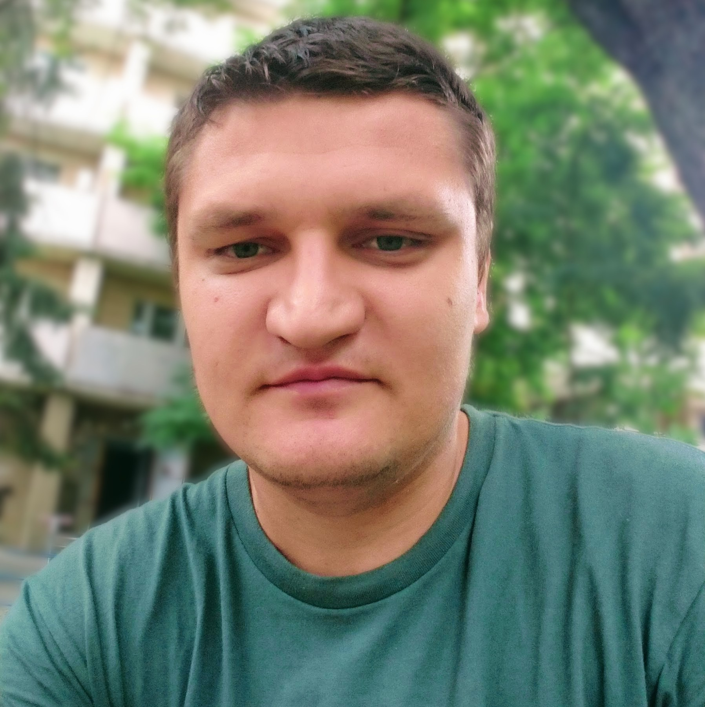
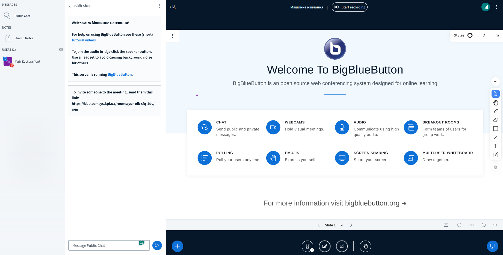
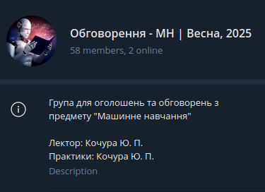
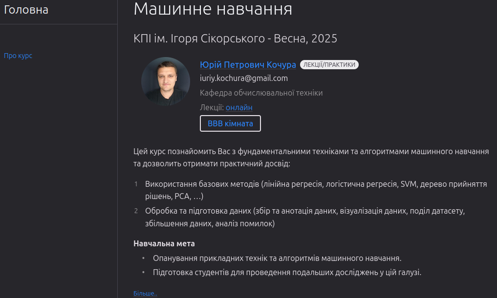
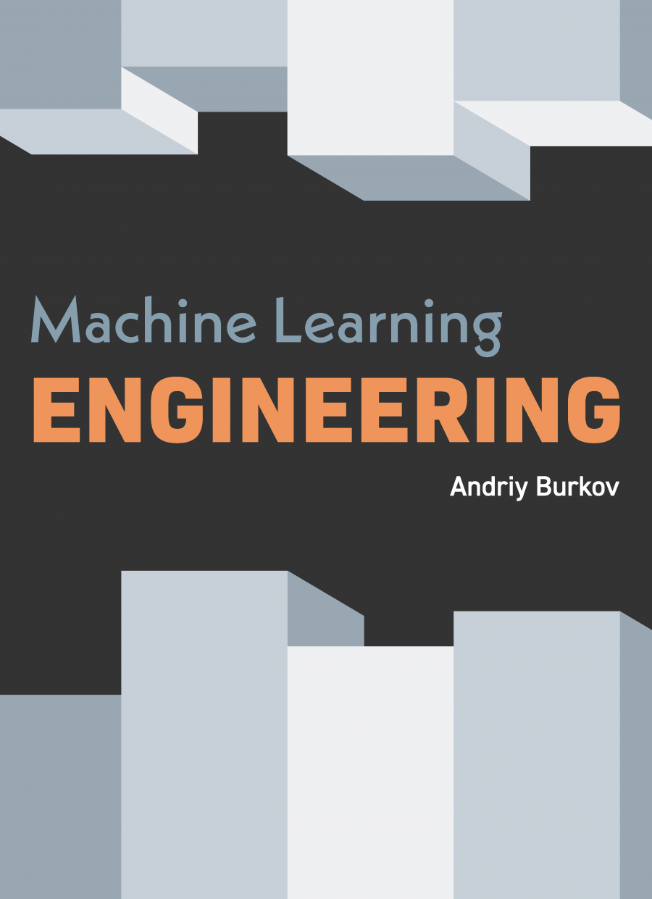
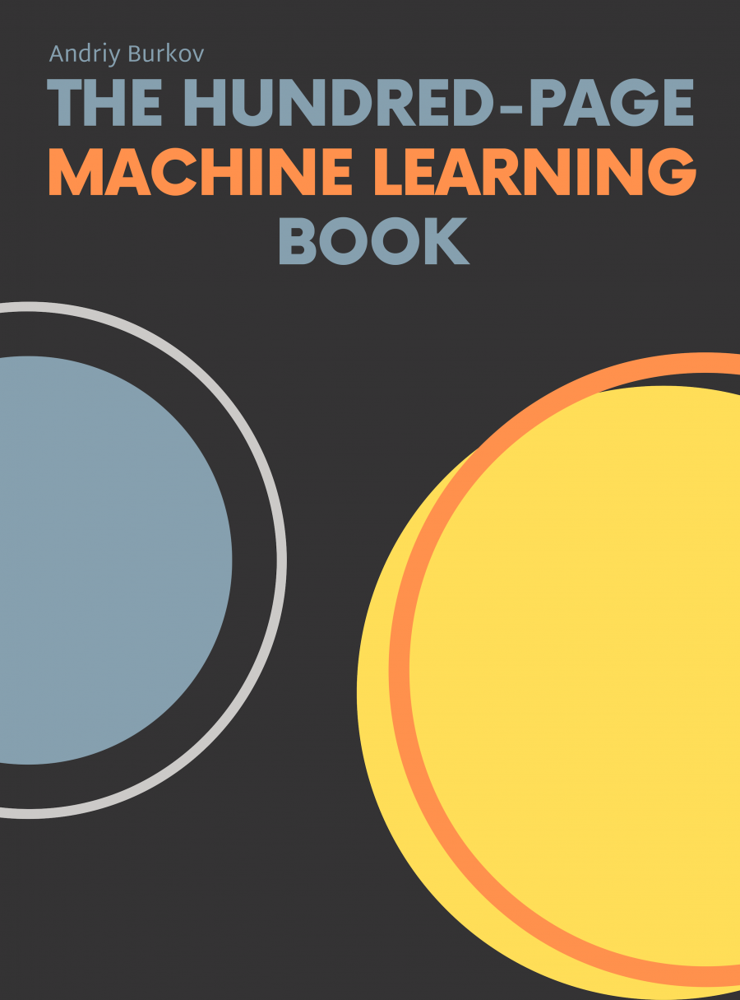
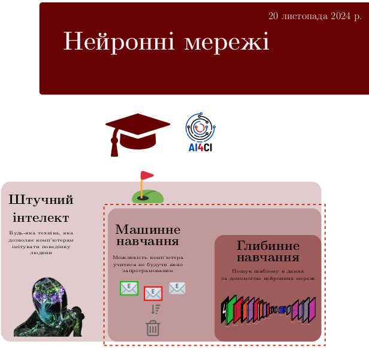
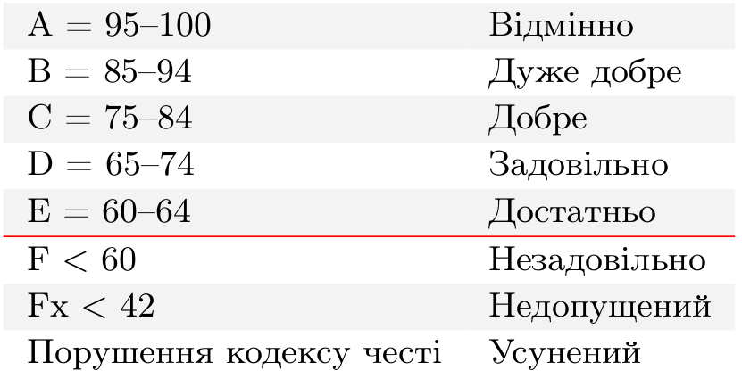

class: middle, center, title-slide 

# Машинне навчання

Весна, 2026

  
Кочура Юрій Петрович 
[iuriy.kochura@gmail.com](mailto:iuriy.kochura@gmail.com)  
<a href="https://t.me/y_kochura">@y_kochura</a>  

---

class: middle 

# Викладачі

.grid[
.kol-1-2[ 
.center.larger-x[📖 Лекції]  
.circle.center.width-60[]
.bold.center[👤 Кочура Юрій Петрович ] 

.bold.center[🏢 Кафедра ОТ, ФІОТ]

]
.kol-1-2[
.center.larger-x[💻 Лабораторні]  
.circle.center.width-60[]
.bold.center[👤 Арсеній Андрійович Хмельницький ] 

.bold.center[🏢 Кафедра ОТ, ФІОТ]

]]

---

class: middle 
# Опис
Цей курс познайомить Вас з фундаментальними техніками і алгоритмами машинного навчання та дозволить отримати практичний досвiд:
  - Використання базових методiв (лiнiйна регресiя, логiстична регресiя, SVM, дерево прийняття рiшень, PCA, …)
 
---

class: middle 
count: false
# Опис
Цей курс познайомить Вас з фундаментальними техніками та алгоритмами машинного навчання та дозволить отримати практичний досвiд:
  - .inactive[Використання базових методiв (лiнiйна регресiя, логiстична регресiя, SVM, дерево прийняття рiшень, PCA, …)]
  - Обробка та підготовка даних (збiр та анотацiя даних, візуалізація даних, подiл датасету, збiльшення даних, аналiз помилок)

---

class: middle 

# Опис

## Навчальна мета
- Опанування прикладних технік та алгоритмів машинного навчання.

---

class: middle 
count: false
# Опис

## Навчальна мета
- .inactive[Опанування прикладних технік та алгоритмів машинного навчання.]
- Підготовка студентів для проведення подальших досліджень у цій галузі.

---

class: middle 
# Потрібні навички

- Рівень володіння англійською мовою не нижче А2.

---

class: middle 
count: false
# Потрібні навички

- .inactive[Рівень володіння англійською мовою не нижче А2.]
- .bold[Математика]: знання та вміння використовувати обчислення, аналітичну геометрію, лінійну алгебру та теорію ймовірностей.

---

class: middle 
count: false
# Потрібні навички

- .inactive[Рівень володіння англійською мовою не нижче А2.]
- .inactive[.bold[Математика]: знання та вміння використовувати обчислення, аналітичну геометрію, лінійну алгебру та теорію ймовірностей.]
- .bold[Програмування]: написання коду на Python.

---

# Аудиторія для лекцій

- Цього семестру .highlight[.bold[лекції]] будуть онлайн у змішаному форматі
 
- Семінар в синхронному режимі онлайн на платформі .bold[*BigBlueButton*]:
.rectangle[BBB кімната:  [https://bbb.comsys.kpi.ua/rooms/yur-olk-sfq-1dv/join](https://bbb.comsys.kpi.ua/rooms/yur-olk-sfq-1dv/join)] 
.rectangle[BBB резерв:  [https://bbb.ugrid.org/b/yur-hbj-mzc-rr4](https://bbb.ugrid.org/b/yur-hbj-mzc-rr4)]

.center.width-90[]

---

class: middle

# Оголошення та обговорення

Усі *оголошення* та *обговорення* будуть здійснюватись в Telegram (повідомте мене, якщо потрібно Вас додати)

.quote[Ставте запитання, діліться корисними ресурсами та спілкуйтеся з одногрупниками і викладачами.]

.center.width-40[]
.center.smaller-x[Оголошення + обговорення]

---

class: middle

# Що робити, якщо розпочалась повітряна тривога?

.alert[📢 У випадку оголошення повітряної тривоги  &mdash; залиште заняття та .bold[прямуйте до найближчого укриття].]

---

class: middle 
# Вебсторінка

Навчальні матеріали будуть розміщуватись на цій вебсторінці:   .rectangle[[https://courses-cs-kpi.github.io/ml-26sp/](https://courses-cs-kpi.github.io/ml-26sp/)]

.center.width-80[]

---

class: middle

# Підручники

.grid[
.kol-1-3[
[.center.width-95[]](http://www.mlebook.com/wiki/doku.php?id=start)
.center[Безкоштовно]
]

.kol-1-3[
[.center.width-95[]](http://themlbook.com/wiki/doku.php)
.center[Безкоштовно]
]

.kol-1-3[
[.center.width-95[]](https://github.com/dml-book/dml/releases/download/v0.1.10/0.1.10-final.pdf)
.center[Безкоштовно]
  ]
]

---

class: middle
# Особливості

- Для магiстрiв 1-го курсу
- Мова викладання: українська, англiйська
- 8 лекцій
- 4 семінари
- 4 практичнi роботи + контрольна
- Екзамен

---

class: middle

# Практичні завдання

Вправи, які допоможуть Вам краще познайомитись з предметом. 

---

class: middle

# Семінар 

Семінарське заняття &mdash; форма навчального заняття, при якій викладач організує дискусію навколо попередньо визначених тем, до котрих студенти готують тези виступів на підставі індивідуально виконаних завдань (рефератів). Семінарські заняття проводяться в аудиторіях, навчальних кабінетах або на онлайн-зустрічах з однією академічною групою. 

.footnote[Джерело: [Вікіпедія](https://uk.wikipedia.org/wiki/%D0%A1%D0%B5%D0%BC%D1%96%D0%BD%D0%B0%D1%80)]

???
Семінари (метод викладання) &mdash; англ. Seminars (teaching method) &mdash; зібрання групи студентів, які зайняті науковими дослідженнями або вивченням наукових проблем, під керівництвом одного або декількох викладачів для обговорення питань, що представляють взаємну цікавість.

Семінарське заняття &mdash; форма навчального заняття, при якій викладач організує дискусію навколо попередньо визначених тем, до котрих студенти готують тези виступів на підставі індивідуально виконаних завдань (рефератів). Семінарські заняття проводяться в аудиторіях, навчальних кабінетах або на онлайн-зустрічах з однією академічною групою.

---

class: middle
# Система оцінювання

- 40%  &nbsp;&emsp; Практичнi завдання (10% кожне)
- 10%  &nbsp;&emsp; Контрольна
- 20%  &nbsp;&emsp; Семінар
- 30%  &nbsp;&emsp; Екзамен 

**Примітка!** Умова допуску до семестрового контролю (екзамену): 
 .center[*Практичні + Контрольна +  Семінар* $\geq 42\%$]

---

class: middle 
# Шкала оцінок

Шкала оцiнок [КПI iм. Iгоря Сiкорського](https://kpi.ua/grading):

.center.width-65[]

---

class: middle 
# Кодекс честі

## Академічна доброчесність

Ви можете обговорювати завдання практичних робiт у групах. Однак, кожен студент(-ка)
повинен(-на) пiдготувати розв’язки завдань самостiйно. Пiд час проходження цього курсу Ви
зобов’язанi дотримуватись політики та принципів академічної доброчесності визначених
Кодексом честi КПI iм. Iгоря Сiкорського ([Розліл 3](https://kpi.ua/code)) та усi наступнi
правила:

---

class: middle 
count: false
# Кодекс честі

## Академічна доброчесність

Ви можете обговорювати завдання практичних робiт у групах. Однак, кожен студент(-ка)
повинен(-на) пiдготувати розв’язки завдань самостiйно. Пiд час проходження цього курсу Ви
зобов’язанi дотримуватись політики та принципів академічної доброчесності визначених
Кодексом честi КПI iм. Iгоря Сiкорського ([Розліл 3](https://kpi.ua/code)) та усi наступнi
правила:

1. Кожен з Вас повинен вiдправляти на перевiрку .highlight[.bold[власно виконану роботу]]. Використання чужих розв’язкiв або програмного коду i представлення їх за свої напрацювання є плагiатом та серйозним порушенням основних академiчних стандартiв.

---

class: middle 
count: false
# Кодекс честі

## Академічна доброчесність

Ви можете обговорювати завдання практичних робiт у групах. Однак, кожен студент(-ка)
повинен(-на) пiдготувати розв’язки завдань самостiйно. Пiд час проходження цього курсу Ви
зобов’язанi дотримуватись політики та принципів академічної доброчесності визначених
Кодексом честi КПI iм. Iгоря Сiкорського ([Розліл 3](https://kpi.ua/code)) та усi наступнi
правила:

1. .inactive[Кожен з Вас повинен вiдправляти на перевiрку власно виконану роботу. Використання чужих розв’язкiв або програмного коду i представлення їх за свої напрацювання є плагiатом та серйозним порушенням основних академiчних стандартiв.]

1. Ви не повиннi дiлитися своїми розв’язками з iншими студентами, а також просити iнших дiлитися своїми розв’язками з Вами.

---

class: middle 
count: false
# Кодекс честі

## Академічна доброчесність

Ви можете обговорювати завдання практичних робiт у групах. Однак, кожен студент(-ка)
повинен(-на) пiдготувати розв’язки завдань самостiйно. Пiд час проходження цього курсу Ви
зобов’язанi дотримуватись політики та принципів академічної доброчесності визначених
Кодексом честi КПI iм. Iгоря Сiкорського ([Розліл 3](https://kpi.ua/code)) та усi наступнi
правила:

1. .inactive[Кожен з Вас повинен вiдправляти на перевiрку власно виконану роботу. Використання чужих розв’язкiв або програмного коду i представлення їх за свої напрацювання є плагiатом та серйозним порушенням основних академiчних стандартiв.]

1. .inactive[Ви не повиннi дiлитися своїми розв’язками з iншими студентами, а також просити iнших дiлитися своїми розв’язками з Вами.]

1. Якщо Ви отримували допомогу у вирiшеннi певного завдання, Ви маєте зазначити це у звiтi, а саме: вiд кого та яку допомогу отримали.

---

class: end-slide, center
count: false

.larger-xx[Почнемо 🎬⏳] 