class: middle, center, title-slide

# Машинне навчання

Лекція 1:  Вступ до машинного навчання

  
Кочура Юрій Петрович 
[iuriy.kochura@gmail.com](mailto:iuriy.kochura@gmail.com)  
<a href="https://t.me/y_kochura">@y_kochura</a>  

---

class:  black-slide,
background-image: url(./figures/lec1/ml.png)

# Сьогодні
.larger-x[ 
 

🎙️ Інтелект vs штучний інтелект  
🎙️ Машинне навчання   
🎙️ Облсті застосування та успіхи ШІ  

]

---

class: blue-slide, middle, center
count: false

.larger-xx[Інтелект   vs   Штучний інтелект]

---

class: middle

# Чи може машина думати?
.grid[
.kol-2-3[
.width-90[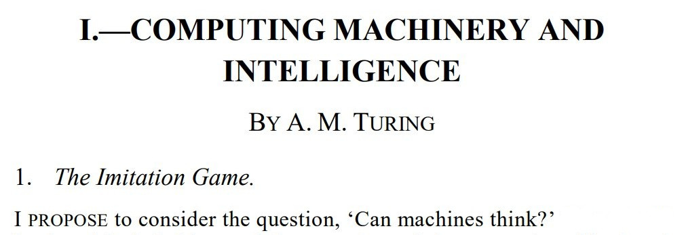]

.pull-right[&mdash; Alan Turing, 1950]
]

.kol-1-3[.center.circle.width-70[]

.center.smaller-xxx[Image source: [biography](https://www.biography.com/scientist/alan-turing)]
  ]
]

.footnote[Credits: [Alan Turing](https://academic.oup.com/mind/article/LIX/236/433/986238), 1950.]

???

Що таке свідомість?
Чи можуть машини думати?

Британський науковець Алан Тюрінг задавався питанням
чи може комп'ютер розмовляти, як людина?

Це запитання призвело до ідеї оцінки штучного інтелекту, що, як відомо, втілилося у відомому тесті Тюрінга. У 1950 році в статті "Обчислювальна техніка та інтелект" Тюрінг запропонував наступну гру.
Суддя-людина переписується з учасниками (гравцями), яких він не бачить, та оцінює їхні відповіді. Щоб пройти тест, комп'ютер повинен бути у змозі підмінити одного з учасників, не помітивши підміни. Іншими словами, комп'ютер вважатиметься розумним, якщо його розмову неможливо буде легко відрізнити від людської.

---

class: middle
count: false

.smaller-x.italic[
In the process of trying to imitate an adult human mind we are bound to think a good deal about
the process which has brought it to the state that it is in. We may notice three components,

  a. The initial state of the mind, say at birth,

  b. The education to which it has been subjected,

  c. Other experience, not to be described as education, to which it has been subjected.

Instead of trying to produce a programme to simulate the adult mind, why not rather try to produce
one which simulates the child’s? If this were then subjected to an appropriate course of education one
would obtain the adult brain. Presumably the child-brain is something like a note-book as one buys
it from the stationers. Rather little mechanism, and lots of blank sheets. (Mechanism and writing
are from our point of view almost synonymous.) Our hope is that there is so little mechanism in
the child-brain that something like it can be easily programmed.

]

.pull-right[&mdash; Alan Turing, 1950]

.footnote[Credits: [Alan Turing](https://academic.oup.com/mind/article/LIX/236/433/986238), 1950.]

???

Намагаючись імітувати розум дорослої людини, ми зобов’язані багато думати про процес, який привів його до стану, в якому він перебуває. Ми можемо помітити три компоненти:

a. Початковий стан розуму, скажімо, при народженні

b. Освіта, якій людина була піддана,

в. Інший досвід, який не можна назвати навчанням, якому він був підданий.

Замість того, щоб намагатися створити програму для моделювання розуму дорослого, чому б не спробувати створити таку, яка моделює розум дитини? Якби це потім було піддано відповідному курсу освіти, можна було б отримати дорослий мозок. Імовірно, дитячий мозок — це щось на кшталт зошита, оскільки його купують у канцтоварах. Досить маленький механізм і багато чистих аркушів. (Механізм і письмо з нашої точки зору майже синоніми.) Ми сподіваємось, що в дитячому мозку настільки мало механізмів, що щось подібне можна легко запрограмувати.

---

class: middle

# Що таке інтелект?

- Інтелект &mdash; це про здатність

.bold.center.larger-x[навчатися приймати рішення для досягнення цілей]
   

- Навчання, прийняття рішення, та цілі є ключовими

---

class: middle

# Що таке штучний інтелект?

- У широкому сенсі 

.bold.larger-x[Будь-яка техніка, яка дозволяє комп'ютерам імітувати поведінку людини]
   
---

class: middle

# Що таке штучний інтелект?

- У вузькому сенсі 

.alert[
.bold.larger-x[**Штучний інтелект** &mdash; здатність інженерної системи обробляти, застосовувати та вдосконалювати здобуті знання та вміння.]]

- **Знання** &mdash; це факти, інформація та навички, набуті через досвід або навчання.

.footnote[Credits: [ISO/IEC TR 24028:2020(en)](https://www.iso.org/obp/ui/#iso:std:iso-iec:tr:24028:ed-1:v1:en:term:3.4), 2020.]

---

class: middle

## Коротка історія

.center.width-90[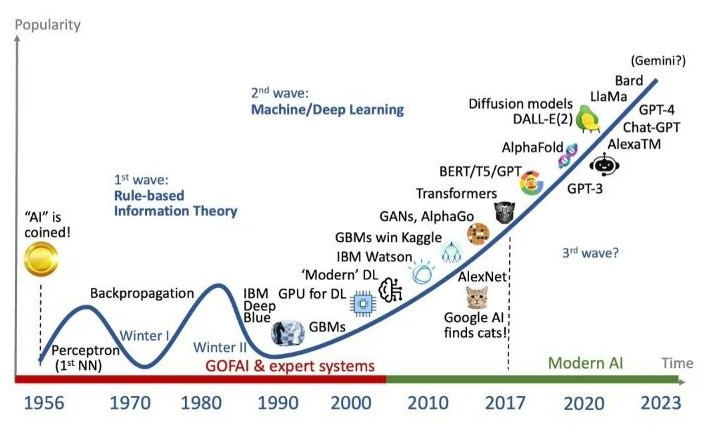] 

.footnote[Джерело зображення: [Jagruti Vekariya](https://www.linkedin.com/posts/jagrutivekariya_ai-techevolution-aiprogress-activity-7126894644767956993-CTLd/).]

---

count: false
class: middle

## Коротка історія

.grid[
.kol-2-3[

.smaller-xx[
- 1940—1952: Early days
  - 1943: McCulloch & Pitts: Boolean circuit model of brain
  - 1950: Turing's ''Computing Machinery and Intelligence''

- 1952–1956:  The birth of AI
  - 1950s: Early AI programs, including Samuel's checkers program,
Newell & Simon's Logic Theorist, Gelernter's Geometry Engine
  - 1956: Dartmouth meeting: ''Artificial Intelligence'' adopted

- 1956–1974: The golden years 
  - 1958: Frank Rosenblatt invented [perceptron](https://en.wikipedia.org/wiki/Perceptron) (simple neural network)
  - 1964: [Bobrow's program](https://en.wikipedia.org/wiki/STUDENT_(computer_program) that solves algebra word problems
  - 1965: Robinson's complete algorithm for logical reasoning

- 1974–1980: The first AI winter

- 1980–1987: Expert systems industry boom
- 1987—1993: Expert systems industry busts: the second AI winter 

- 1993–2011: Statistical approaches 
  - Resurgence of probability, focus on uncertainty
  - General increase in technical depth
  - Intelligent agents

- 2011–present: Deep Learning, Big Data and AI
  - Big data, big compute, neural networks
  - AI used in many industries
]

]
.kol-1-3[.middle.center.width-100[]]
]

.footnote[Credits: [Wikipedia - History of artificial intelligence](https://en.wikipedia.org/wiki/History_of_artificial_intelligence#Deep_learning)]

---

class: middle

# AI &mdash; багата галузь

.center.width-90[]

.footnote[Image Source: [Marizel B. and Ma. Louella Salenga](https://www.researchgate.net/publication/324183626_Bitter_Melon_Crop_Yield_Prediction_using_Machine_Learning_Algorithm), 2018.]

---

class: middle

.center.width-90[]

.footnote[Image Source: [Why you Might Want to use Machine Learning](https://ml-ops.org/content/motivation).]

---

class: middle

.center.width-50[]

"Just as electricity transformed almost everything 100 years ago, today I actually have a hard time thinking of an industry that I don't think AI will transform in the next several years."

.pull-right[&mdash; Andrew Ng]

.footnote[Credits: [Andrew Ng: Artificial Intelligence is the New Electricity](https://www.youtube.com/watch?v=21EiKfQYZXc), 2017.]

---

class: blue-slide, middle, center
count: false

.larger-xx[Машинне навчання]

---

class: middle

.center[
.width-45[] &nbsp; &nbsp;
.width-45[]
]

.question[Чи могли б ви написали комп’ютерну програму, яка розпізнає *котів* від *собак*?]

---

class: middle

.center.width-60[]

---

count: false
class: middle

.center.width-60[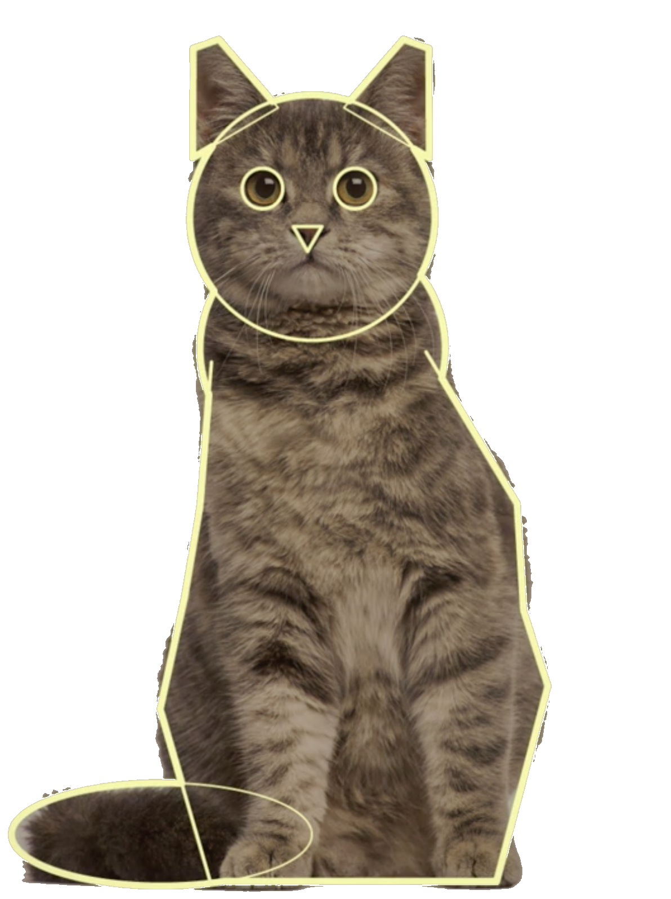]

---

count: false
class: black-slide, middle
background-image: url(figures/lec1/cat3.png)
background-size: cover

---

count: false
class: black-slide, middle

background-image: url(figures/lec1/cat4.png)
background-size: cover

---

count: false
class: middle

background-image: url(figures/lec1/cats.jpg)
background-size: contain

---

count: false
class: middle

background-image: url(figures/lec1/dogs.jpeg) 
background-size: contain

---

class: middle

Для пошуку шаблону в даних (витягування семантичної інформації, ознак) потрібна побудова **складних моделей**, які б отримати вручну було б дуже складно.

Однак, можна використати алгоритм машинного навчання, який буде **вчитись** знаходити шаблон у даних самостійно. 

---

class: middle

.center.width-100[]

.center[Підхід глибокого навчання]

---

class: middle

.center.width-100[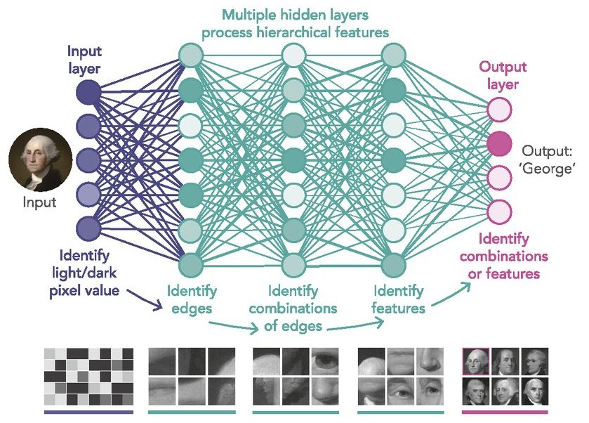]

---

class: middle, center

# Що таке машинне навчання?

---

class: middle

# Визначення за Артур Семюель

.center[
.width-100[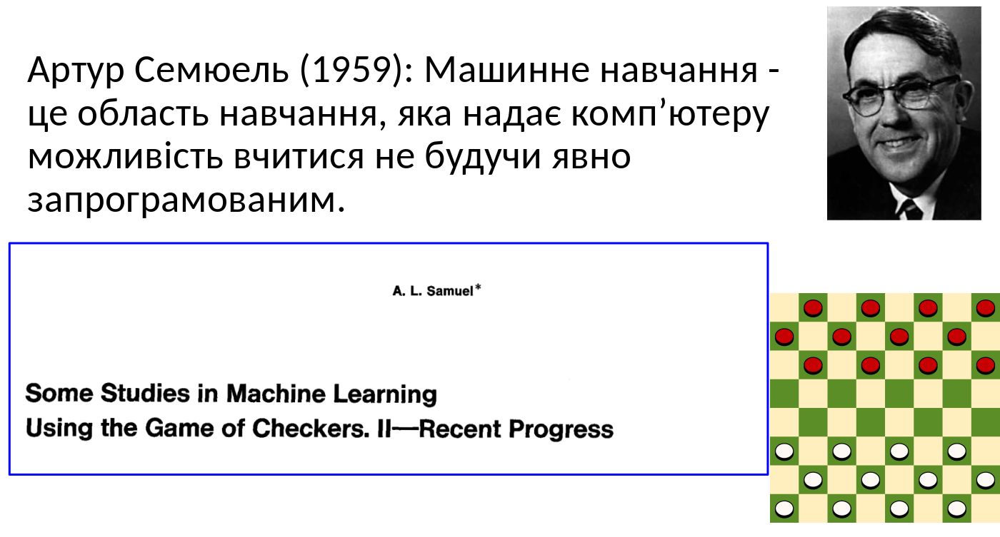]
]

---

class: middle

# Визначення за Том Мітчелл

Том Мітчелл (1998): Комп’ютерна програма, яка учиться з досвiду **E** по вiдношенню до деякого
класу задач **T** та мiри продуктивностi **P** називається машинним навчанням, якщо її продуктивнiсть у задачах
з **T**, що вимiрюється за допомогою **P**, покращується з досвiдом **E**.

.right[
.width-30[]
]

  - Досвід (дані): ігри в які грає програма сама з собою
  - Вимір продуктивності: коефіцієнт виграшу

---

class: middle

# Класичне програмування vs машинне навчання

.center[
.width-100[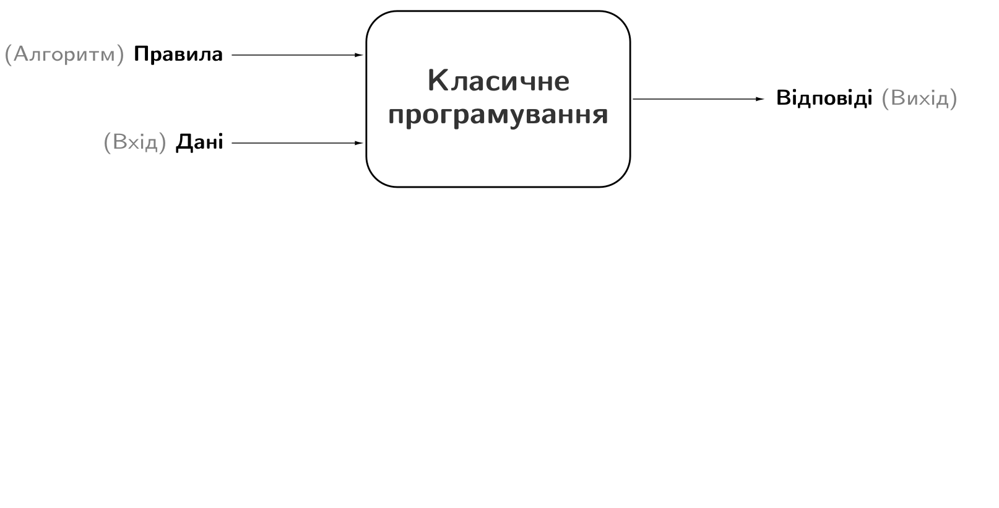]
]

???

Комп’ютери та обчислення допомагають нам досягати бiльш складних цiлей i кращих результатiв у вирiшеннi
проблем, нiж ми могли б досягти самi. Однак, багато сучасних завдань вийшли за рамки обчислень через один
основний обмежуючий фактор: традицiйно, комп’ютери можуть дотримуватися лише конкретних
вказiвок/iнструкцiй, якi їм дають.

Вирiшення проблем з програмування вимагає написання конкретних покрокових iнструкцiй, якi має виконувати комп’ютер. Ми називаємо цi кроки алгоритмами. У цьому випадку, комп’ютери можуть допомогти нам
там, де ми:
1. Розумiємо як вирiшити проблему.
2. Можемо описати проблему за допомогою чiтких покрокових iнструкцiй, якi комп’ютер може зрозумiти.

---

class: middle
count: false

# Класичне програмування vs машинне навчання

.center[
.width-100[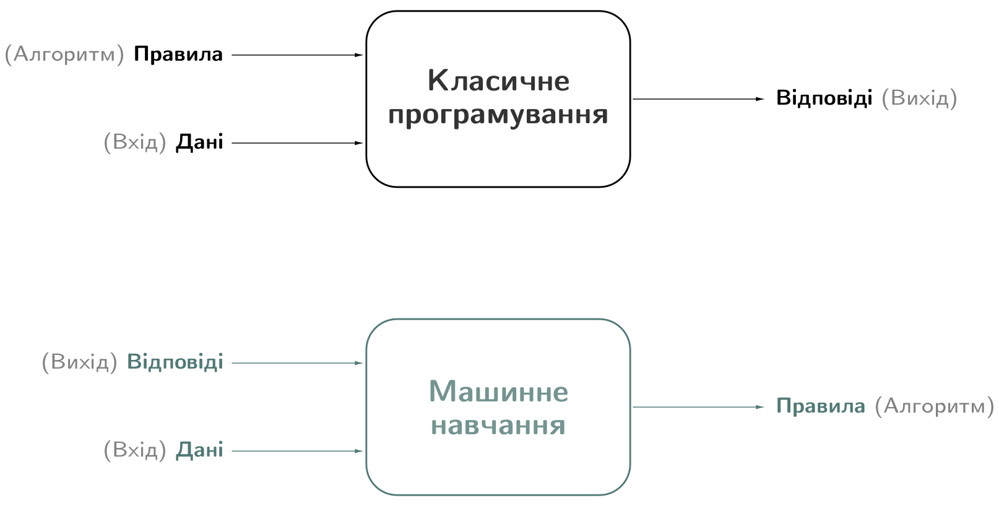]
]

???

Методи машинного навчання дозволяють комп’ютерам “учитися” на прикладах. Вирiшення проблем iз застосуванням машинного навчання вимагає виявлення деякого шаблону, а потiм, коли такий шаблон готовий, дозволяють, наприклад, нейроннiй мережi вивчити карту переходiв мiж вхiдними та вихiдними даними. Ця особливiсть вiдкриває новi типи проблем, де комп’ютери можуть допомогти нам у їх розв’язаннi, за умови, коли ми:
1. Визначили шаблон проблеми.
2. Маємо достатньо даних, що iлюструють шаблон.
---

class: middle

# Типи навчання

За характером навчальних даних (**досвiду**) машинне навчання подiляють на чотири типи: контрольоване (з учителем), напiвконтрольоване, неконтрольоване (без учителя) та з пiдкрiпленням.

.center[
.width-100[]
]

---

class: middle
count: false

# Типи навчання

.center[
.width-100[]
]

---

class: middle
count: false

# Типи навчання

.center[
.width-100[]
]

---

class: middle
count: false

# Типи навчання

.center[
.width-100[]
]

---

class: middle

# Навчання з учителем
## Постановка задачі

Нехай $\mathbf{d} \sim p(\mathbf{X}, y)$ &mdash; датасет з $n$ пар прикладів вхід-вихід

 $$\mathbf{d} = \\{(\mathbf{X}^{(1)}, y^{(1)}), (\mathbf{X}^{(2)}, y^{(2)}),..., (\mathbf{X}^{(n)}, y^{(n)})\\},$$
де $\mathbf{X}^{(i)} = (x^{(i)}_1, x^{(i)}_2, ..., x^{(i)}_m)$ &mdash; вхідний вектор ознак,  $y^{(i)}$ &mdash; мітка (вихід), як правило, $y^{(i)} \in \mathbb{R}\ \text{або}\ y^{(i)} \in \mathbb{N}$.

На основі цих даних ми хочемо визначити статистичну модель $$p(y|\mathbf{X}),$$ яка буде найкраще пояснювати дані.

---

class: middle

# Вектор ознак

- Кожен вхідний приклад $\mathbf{X} \in \mathbb{R}^m$ &mdash; вектор вхідних ознак, який складається з $m$ атрибутів або ознак.
- Якщо дані спочатку не виражені як дійсні вектори, тоді їх потрібно підготувати та перетворити в цей формат.

---

# Лінійна регресія

Якщо $y \in \mathbb{R}$. 

.center.width-70[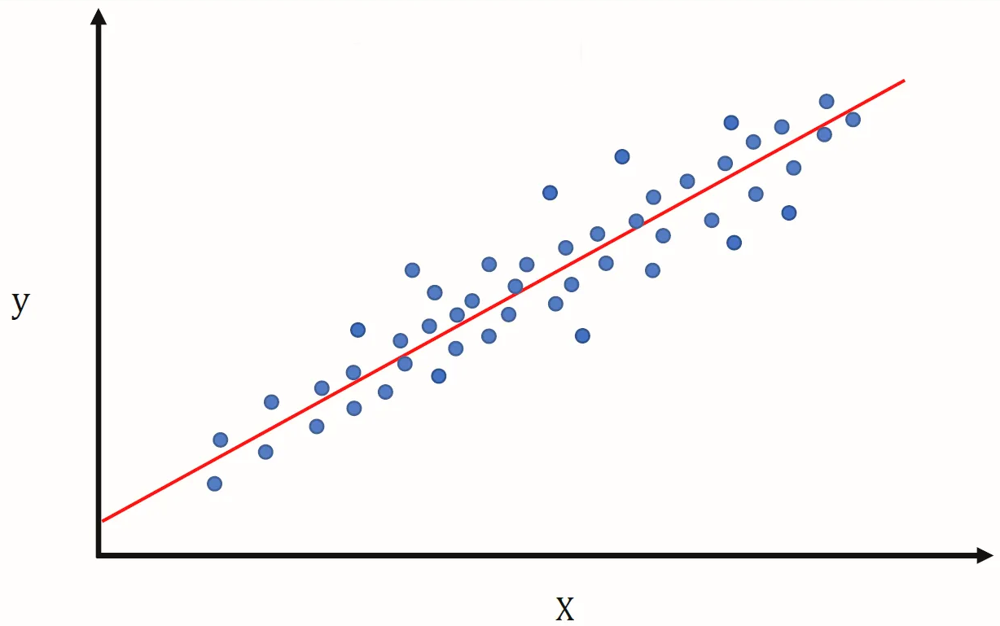]

$$\hat y  = W \cdot X + b$$

Алгоритм регресії прагне відшукати лінію чи гіперповерхню, яка найближче знаходиться до прикладів: $(\mathbf{X}^{(i)}, y^{(i)})$. Одновимірна регресія: $\mathbf{X}^{(i)} = (x^{(i)}_1)$

???
Y -- залежна змінна, і вона неперервна - наприклад, кількість продажів, ціна, вага. Це змінна, значення якої ми намагаємося передбачити. X - незалежна змінна. Ми використовуємо цю змінну для прогнозування значення Y.

---

courn: false
class: middle

# Лінійна регресія

## Втрати

$$L^{(i)}(\hat y,y)  =  \Big(\hat{y}^{(i)} -  y^{(i)} \Big)^2$$

.center.width-80[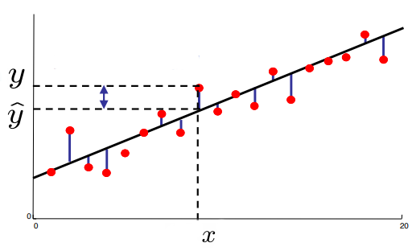]

---

courn: false
class: middle

# Лінійна регресія

## Цільова функція

$$J(\hat y,y)  = \frac{1}{n} \sum\_{i=1}^n L^{(i)} = \frac{1}{n} \sum\_{i=1}^n \Big(\hat{y}^{(i)} -  y^{(i)} \Big)^2$$
.center.width-70[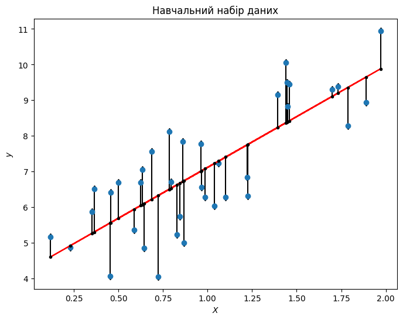]

Алгоритм регресії прагне відшукати лінію чи гіперповерхню, яка найближче знаходиться до прикладів: $(\mathbf{X}^{(i)}, y^{(i)})$. Одновимірна регресія: $\mathbf{X}^{(i)} = (x^{(i)}_1)$

???
Y -- залежна змінна, і вона неперервна - наприклад, кількість продажів, ціна, вага. Це змінна, значення якої ми намагаємося передбачити. X - незалежна змінна. Ми використовуємо цю змінну для прогнозування значення Y.

---

count: false
class: middle

# Лінійна регресія

.center.width-100[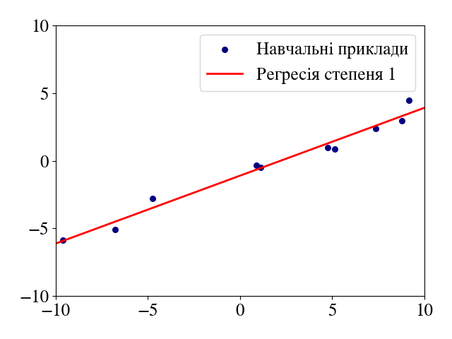]

---

class: middle

# Логістична регресія

Якщо $y \in \{0, 1\}$.

.center.width-40[]

$$\hat y  = \sigma(z) = \frac{1}{1 + \exp(-z)} = \frac{1}{1 + \exp(-(W \cdot X + b))}$$

У разі класифікації алгоритм навчання шукає лінію (або, у загальному випадку, гіперповерхню), яка поділяє приклади різних класів.

.footnote[Джерело зображення: [CS188](https://inst.eecs.berkeley.edu/~cs188/), UC Berkeley.]

---

class: middle
# Логістична регресія

## Втрати 

$$L^{(i)}(\hat y,y)  = -  \Big[ y^{(i)} \log(\hat{y}^{(i)}) + (1 - y^{(i)}) \log(1 - \hat{y}^{(i)}) \Big]$$

 

## Цільова функція

$$J(\hat y,y)  = \frac{1}{n} \sum\_{i=1}^n L^{(i)}=  - \frac{1}{n} \sum_{i=1}^n \Big[ y^{(i)} \log(\hat{y}^{(i)}) + (1 - y^{(i)}) \log(1 - \hat{y}^{(i)}) \Big]$$

---

class: middle

# Класифікація vs  регресія

.grid[
.kol-1-2[
.center.width-95[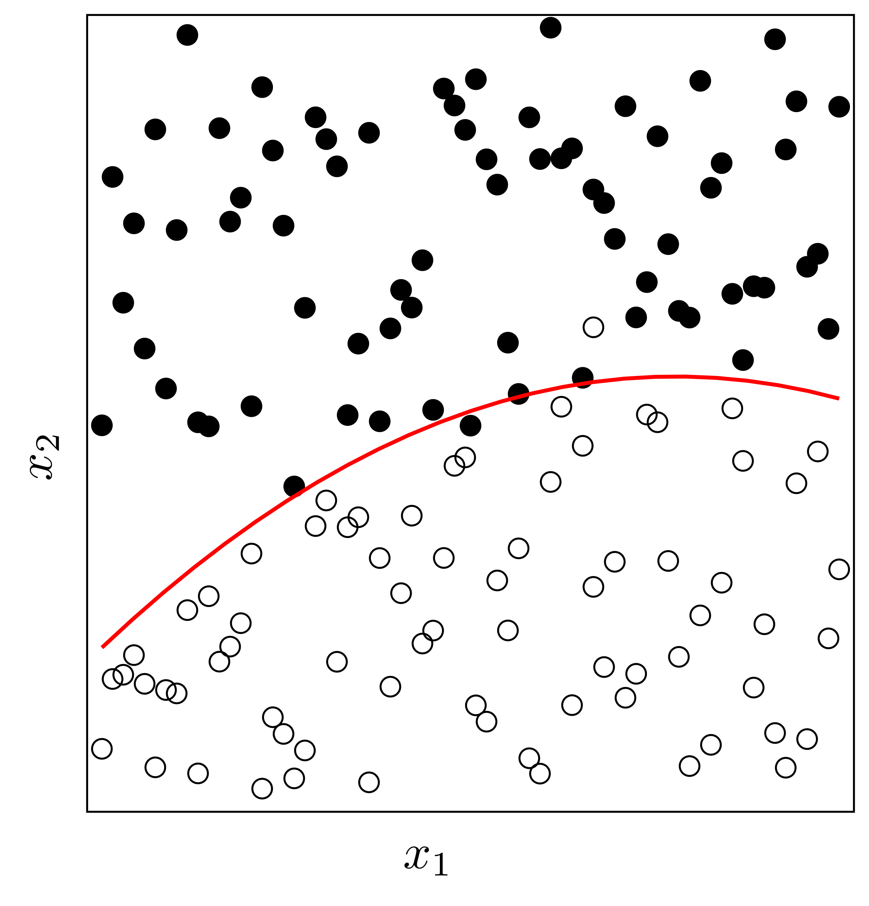]
.center[Класифікація]
]

.kol-1-2[
.center.width-95[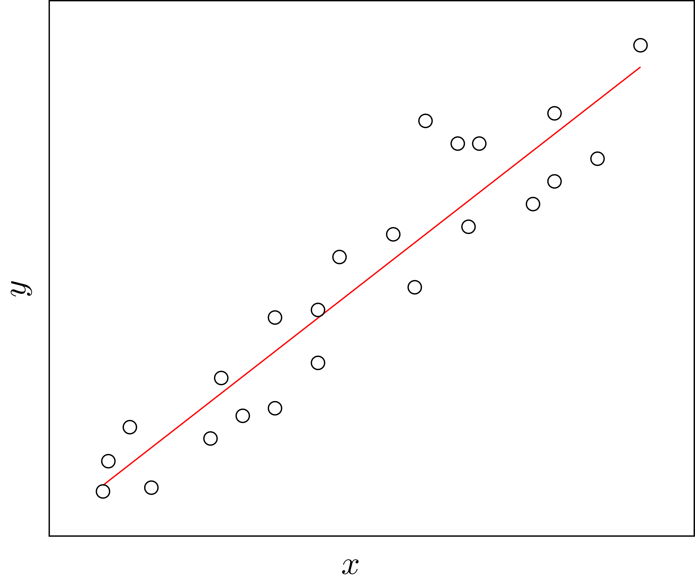]
.center[Регресія]
]]

---

class: middle

# Як вчиться людина?

- Ми та інші розумні істоти, вчимось завдяки **взаємодії із своїм оточенням**

- Взаємодії часто бувають **послідовними** - майбутні взаємодії можуть залежати від попередніх

- Ми направлені на **результат**

- Ми можемо вчитися **не маючи прикладів** оптимальної поведінки

???

Нейронні мережі, прекрасна біологічно натхненна парадигма програмування, яка дозволяє комп’ютеру навчатися на основі даних спостережень

---

class: middle

# Мозок людини

Базовою обчислювальною одиницею мозку є нейрон. Мозок дорослої людини складається з $86$ мiльярдiв нейронiв, якi з’єднанi між собою приблизно
$10^{14}$ − $10^{15}$ синапсами.

.footnote[Джерело: [F. A. Azevedo та ін.](https://onlinelibrary.wiley.com/doi/abs/10.1002/cne.21974), 2009.]

---

class: middle

# Біологічний та штучний нейрон

.center[
.width-100[]
]

---

class: middle,
# Деякі функції активації

.center[
.width-100[]
]

---

class: middle

# Людина добре сприймати візуальну інформацію

---

class: middle, center

.width-100[]

Що Ви бачите?

???

.italic[Як Ви це робите?]

---

class: middle

.center[
.width-70[]

Собака-вівця чи швабра?
]

---

class: middle

.center[
.width-70[]

Кекс чи собака?
]

---

class: middle

Людський мозок настільки добре інтерпретує візуальну інформацію, що **розрив** між зображенням та його семантичною інтерпретацією (пікселями) важко оцінити інтуїтивно: 

 
.center[

Це мухомор.
]

---

class: middle, center

.width-70[]

Це мухомор.

---

class: middle, center

.width-30[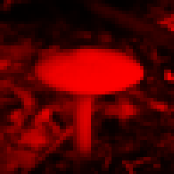] +
.width-30[] +
.width-30[]

Це мухомор.

---

class: middle, center

.width-80[]

Це мухомор.

---

class: middle

# Що входить до задачі машинного навчання?

- Постановка проблеми + збір даних
- Навчання моделі
- Визначення функції втрат
- Вибір алгоритму оптимізації

---

class: middle

# Які дані використовуються?

.center.width-100[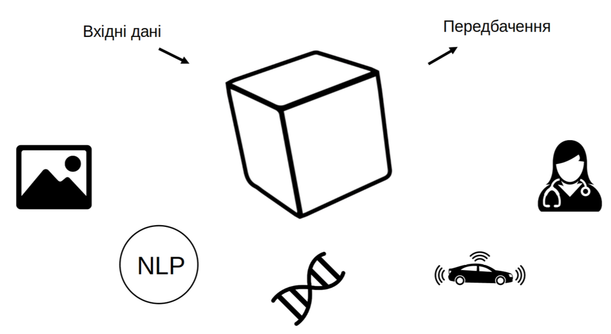]

---

class: middle

# Ознаки у машинному навчанні

Ознаки - це спостереження, які використовуються для прийняття рішень моделлю.

- Для класифікації зображень **кожен** піксель є ознакою
- Для розпізнавання голосу, **частота** та **гучність** є ознаками
- Для безпілотних автомобілів дані з **камер**, **радарів** і **GPS** є ознаками

---

class: middle

# Типи ознак у робототехніці

- Пікселі (RGB дані)
- Глибина (сонар, лазерні далекоміри)
- Орієнтація або прискорення (гіроскоп, акселерометр, компас)

---

class: middle

# Недонавчання vs перенавчання

.center.width-100[]

---

class: middle
count: false

# Недонавчання vs перенавчання

.center.width-80[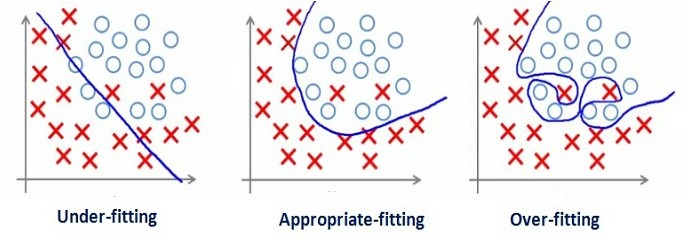]

---

class: middle

# Що таке модель?

Хоча те, що знаходиться всерединi глибинної нейронної мережi, може бути складним, за своєю суттю це просто функцiї. Вони беруть певнi вхiднi данi: **INPUT x** i
генерують деякi вихiднi данi: **OUTPUT f(x)**

.center.width-30[]

---

# З чого складається модель?

.center.width-100[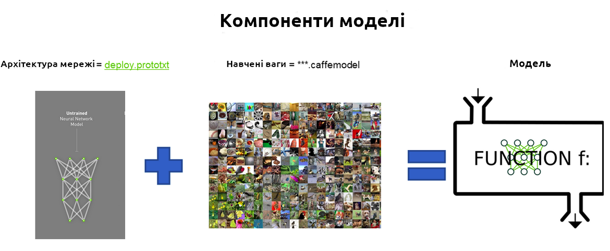]

---

# Джерела помилок моделі

- Зсув  (Bias)
- Розкид (Variance)
- Шум (Irreducible error)

$$Err = Bias^2 + Variance + Irreducible error$$

.center.width-70[]

---

# Інтуїція

  
.center.width-60[]

---

# Інтуїція

## Великий зсув

  
.center.width-70[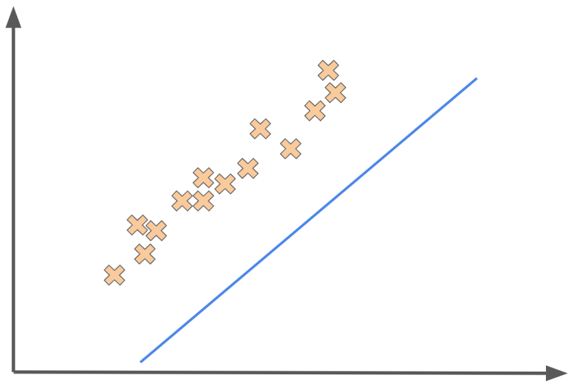]

---

class: blue-slide, middle, center
count: false

.larger-xx[Облсті застосування та успіхи ШІ]

---

class: middle, center, black-slide

<iframe width="600" height="450" src="https://www.youtube.com/embed/5kpsZoKjPgQ" frameborder="0" allowfullscreen></iframe>

Виявлення об'єктів, визначення положення людини, сегментація (2019)

---

class: middle, center, black-slide

<iframe width="600" height="450" src="https://www.youtube.com/embed/hA_-MkU0Nfw" frameborder="0" allowfullscreen></iframe>

Створення автономних автомобілів (Waymo, 2022)

---

class: middle, black-slide, center

<iframe width="600" height="450" src="https://www.youtube.com/embed/zrcxLZmOyNA" frameborder="0" allowfullscreen></iframe>

Рушій для розвитку чистої енергії (NVIDIA, 2023)

---

class: middle, black-slide, center

<iframe width="600" height="450" src="https://www.youtube.com/embed/AbdVsi1VjQY" frameborder="0" allowfullscreen></iframe>

Як ШІ розвиває медицину (Google, 2023)

---

class: middle, center

.center.width-50[]

.center[Med-PaLM 2 (Google) &mdash; це велика мовна модель, налаштована для сфери медицини. Досягає 85%+ точності для запитань у стилі експертизи медичного професійного, три-етапного іспиту (USMLE).] 

???

Що відрізняє ці системи штучного інтелекту  так це те, що вони пропонують новий інтерфейс. ШІ більше не вбудований в інструменти, а знаходять у  прямому контакті з нами, людьми.  Наприклад, Med-PaLM 2 — це велика мовна модель, налаштована для сфери медицини. З ним можна взаємодіяти за допомогою природної мови, ніби ви розмовляєте з медичним експертом. Вам не потрібно знати, як писати код або як визначати ці математичні моделі. Ви просто задаєте запитання, і ця модель надасть вам відповідь.

---

class: middle, black-slide

.center[
<video loop controls preload="auto" height="400" width="600">
  <source src="./figures/lec1/physics-simulation.mp4" type="video/mp4">
</video>

Physics simulation (Sanchez-Gonzalez et al, 2020)

]

---

class: middle

## AlphaFold: Від послідовності амінокислот до 3D структури

.grid[
.kol-2-3.center.width-100[]
.kol-1-3.center.width-100[]
]

???

 AlphaFold &mdash; нейронна мережа, заснована на архітектурі трансформер, яка може передбачити тривимірну структуру білка за його амінокислотною послідовністю.

Ця проблема важлива, оскільки тривимірна структура білка визначає його функцію, а розуміння функції білка є ключовим для розуміння біології та розробки нових ліків.

Однак експериментальне визначення 3D-структури білка є складним і дорогим процесом, оскільки лише для визначення однієї структури потрібно кілька місяців.

AlphaFold став проривом у цій галузі та зміг передбачити тривимірну структуру білків з високою точністю всього за пару хвилин для найдовших послідовностей.

---

class: middle, black-slide, center

<iframe width="600" height="450" src="https://www.youtube.com/embed/gg7WjuFs8F4" frameborder="0" allowfullscreen></iframe>

AI for Science (Deepmind, AlphaFold, 2020)

---

class: middle

## Відкриття ліків за допомогою графових нейронних мереж

.center.width-80[]

???

A second example is the use of graph neural networks to discover new drugs.

Discovering new drugs is a complex and expensive search problem, where the goal is to find molecules that will bind to a target protein and modulate its function. Unfortunately, this problem is difficult for two reasons:
- first, the search space is huge -- the space all possible pharmacologically active molecules is estimated to be in the order of 10^60 molecules.
- second, the binding of a molecule to a protein is a complex process that is difficult to model. Laboratory experiments are necessary to evaluate the binding of a molecule to a protein, and these experiments are expensive and time-consuming.

Graph neural networks have been a breakthrough in this area, and have been able to predict the properties of molecules with high accuracy. 

In a sense, they can serve as a virtual laboratory that can be used to pre-screen millions of molecules in a matter of hours, thereby reducing the laboratory work to only the most promising candidates.

---

class: middle, center, black-slide

<iframe width="600" height="450" src="https://www.youtube.com/embed/7gh6_U7Nfjs" frameborder="0" allowfullscreen></iframe>

Speech synthesis and question answering (Google, 2018)

---

class: middle, center, black-slide

<iframe width="600" height="450" src="https://www.youtube.com/embed/kSLJriaOumA" frameborder="0" allowfullscreen></iframe>

Image generation (Karras et al, 2018)

---

class: middle, center, black-slide

<iframe width="600" height="450" src="https://www.youtube.com/embed/qTgPSKKjfVg" frameborder="0" allowfullscreen></iframe>

Image generation and AI art (OpenAI, 2022)

---

class: middle, center, black-slide

<iframe width="600" height="450" src="https://www.youtube.com/embed/J_2fIGmsoRg" frameborder="0" allowfullscreen></iframe>

Reface оживив відомі київські мурали до Дня Києва (2021)

---

class: middle, center, black-slide

<iframe width="600" height="450" src="https://www.youtube.com/embed/Zm9B-DvwOgw" frameborder="0" allowfullscreen></iframe>

Write computer code (OpenAI, 2021)

---

class: middle, center, black-slide

.center.width-100[]

Відповісти на всі ваші запитання (OpenAI, 2022)

---

class: middle

.center.circle.width-30[]

.italic["For the last forty years we have programmed computers; for the next forty years we will train them."]

.pull-right[Chris Bishop, 2020.]

???
Крістофер Бішоп є технічним співробітником Microsoft і директором Microsoft Research AI4Science. Він також є почесним професором комп’ютерних наук Единбурзького університету та членом Дарвінівського коледжу в Кембриджі. У 2017 році він був обраний членом Королівського товариства.

---

class: end-slide, center
count: false

.larger-xx[Кінець]

---

count: false

# Література

- Andriy Burkov (2020). [Machine Learning Engineering](http://www.mlebook.com/wiki/doku.php?id=start). Chapter 1: Introduction.
