class: middle, center, title-slide

# Машинне навчання

Лекція 1:  Вступ до машинного навчання

  
Кочура Юрій Петрович 
[iuriy.kochura@gmail.com](mailto:iuriy.kochura@gmail.com)  
<a href="https://t.me/y_kochura">@y_kochura</a>  

---

class:  black-slide,
background-image: url(./figures/lec1/ml.png)

# Сьогодні
.larger-x[ 
 

🎙️ Інтелект vs штучний інтелект (ШІ)  
🎙️ Машинне навчання   
🎙️ Сфери застосування та успіхи ШІ  

]

---

class: blue-slide, middle, center
count: false

.larger-xx[Інтелект   vs   Штучний інтелект]

---

class: middle

# Що таке інтелект?

- Інтелект &mdash; це про здатність

.bold.center.larger-x[навчатися приймати рішення для досягнення цілей]
   

- Навчання, прийняття рішення, та цілі є ключовими

---

class: middle

# Що таке штучний інтелект?

- У широкому сенсі 

.bold.larger-x[Будь-яка техніка, яка дозволяє комп'ютерам імітувати поведінку людини]
   
---

class: middle

# Що таке штучний інтелект?

- У вузькому сенсі 

.alert[
.bold.larger-x[**Штучний інтелект** &mdash; здатність інженерної системи обробляти, застосовувати та вдосконалювати здобуті знання та вміння.]]

- **Знання** &mdash; це факти, інформація та навички, набуті через досвід або навчання.

.footnote[Credits: [ISO/IEC TR 24028:2020(en)](https://www.iso.org/obp/ui/#iso:std:iso-iec:tr:24028:ed-1:v1:en:term:3.4), 2020.]

---

# Що таке штучний інтелект?

 

.center.circle.width-40[]

.quote.center["Artificial intelligence is the science of making machines do things that would require intelligence if done by men." -- Marvin Minsky, 1968.]

---

class: middle

# Чи можуть машини думати?
.grid[
.kol-2-3[
.width-90[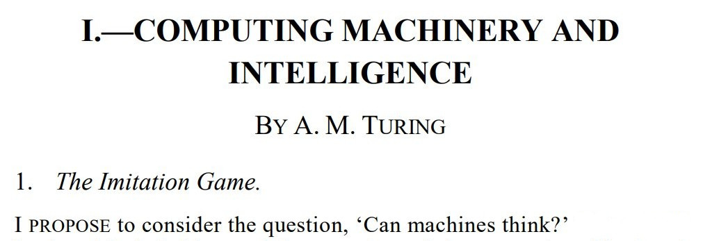]

.pull-right[&mdash; Alan Turing, 1950]
]

.kol-1-3[.center.circle.width-70[]

.center.smaller-xxx[Image source: [biography](https://www.biography.com/scientist/alan-turing)]
  ]
]

.footnote[Credits: [Alan Turing](https://academic.oup.com/mind/article/LIX/236/433/986238), 1950.]

???

Що таке свідомість?
Чи можуть машини думати?

Британський науковець Алан Тюрінг задавався питанням
чи може комп'ютер розмовляти, як людина?

Це запитання призвело до ідеї оцінки штучного інтелекту, що, як відомо, втілилося у відомому тесті Тюрінга. У 1950 році в статті "Обчислювальна техніка та інтелект" Тюрінг запропонував наступну гру.
Суддя-людина переписується з учасниками (гравцями), яких він не бачить, та оцінює їхні відповіді. Щоб пройти тест, комп'ютер повинен бути у змозі підмінити одного з учасників, не помітивши підміни. Іншими словами, комп'ютер вважатиметься розумним, якщо його розмову неможливо буде легко відрізнити від людської.

---

class: middle
count: false

.smaller-x.italic[
Намагаючись зімітувати розум дорослої людини, ми зобов’язані добре подумати про процес, який привів його до стану, в якому він перебуває. Ми можемо помітити три компоненти,

  a. Початковий стан розуму, скажімо, при народженні,

  b. Навчання, якому ми були піддані,

  c. Інший досвід, який не можна назвати навчанням, якому ми були піддані.

Замість того, щоб намагатися створити програму, яка моделює розум дорослої людини, чому б не спробувати створити таку, яка моделює розум дитини? Потім, якби це було піддано належному курсу навчання, можна було б отримати модель мозку дорослої людини. Ймовірно, дитячий мозок &mdash; це щось на зразок чистого зошита, який купуємо у канцтоварах. Досить маленький механізм і багато чистих аркушів. (Механізм і запис з нашої точки зору майже синоніми.) Ми сподіваємось, що в дитячому мозку настільки мало механізмів, що щось подібне можна легко запрограмувати.

]

.pull-right[&mdash; Алан Тюрінг, 1950]

.footnote[Credits: [Alan Turing](https://academic.oup.com/mind/article/LIX/236/433/986238), 1950.]

---

class: middle

## Тест Тюрінга

Вважається, що комп’ютер проходить тест Тюрінга («Гру в імітацію»), якщо людина, отримуючи письмові відповіді на свої запитання, не може встановити, хто їх автор &mdash; людина чи комп’ютер.

.grid[
.kol-2-3[
.width-80.center[ 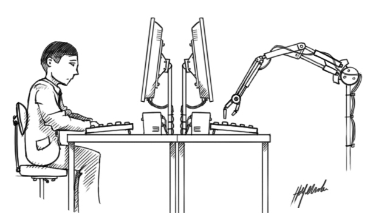]
]
.kol-1-3.center[
.width-90.circle[]
.caption[Чи можуть машини думати?  (Алан Тюрінг, 1950)]
]
]

???

Тест Тюрінга — це операційне (практичне) визначення інтелекту.

---

class: middle

Агент не зможе пройти тест Тюрінга без таких вимог:

- обробка природної мови
- представлення знань
- автоматизоване міркування
- машинне навчання
- комп’ютерний зір (для повного тесту Тюрінга)
- робототехніка (для повного тесту Тюрінга)

.alert[Незважаючи на те, що тест було запропоновано майже 75 років тому, він залишається актуальним і сьогодні.]

---

class: middle

## Коротка історія

.center.width-90[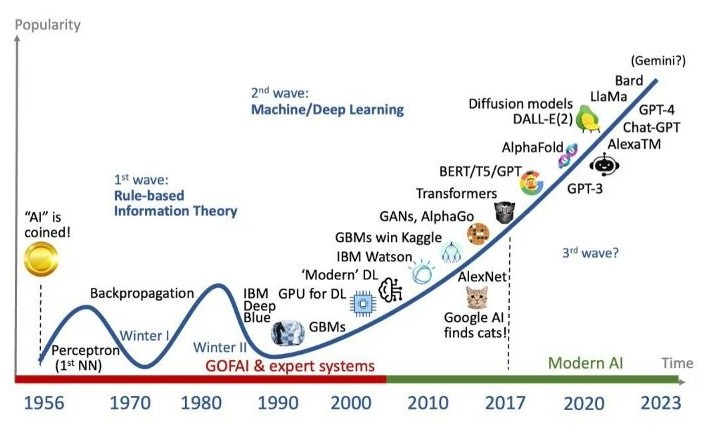] 

.footnote[Джерело зображення: [Jagruti Vekariya](https://www.linkedin.com/posts/jagrutivekariya_ai-techevolution-aiprogress-activity-7126894644767956993-CTLd/).]

---

count: false
class: middle

## Коротка історія

.grid[
.kol-2-3[

.smaller-xx[
- .bold[1940—1952: Ранні дні]
  - 1943: Мак-Каллок & Піттс: Булева модель нейрона
  - 1950: Праця Тюрінга «Обчислювальні машини та інтелект» 

- .bold[1952–1956:  Народження ШІ]
  - 1950s: Ранні програми ШІ, включаючи програму Семюеля для гри в шашки
  - 1956: Дартмутський семінар: запропоновано термін ''Штучний інтелект'' 

- 1956–1974: Золоті роки 
  - 1958: Френк Розенблатт винайшов [перцептрон](https://en.wikipedia.org/wiki/Perceptron) (проста нейронна мережа)
  - 1964: Програма Боброу [STUDENT] <https://en.wikipedia.org/wiki/STUDENT_(computer_program)>, яка вирішує текстові задачі з алгебри

- .bold[1974–1980: Перша зима ШІ]

- .bold[1980–1987: Бум експертних систем]
- .bold[1987—1993: Провали експертних систем: друга зима ШІ] 

- .bold[1993–2011: Статистичні підходи] 
  - Відродження ймовірнісних підходів, зосередженість на невизначеності
  - Розумні агенти

- .bold[2011– 2020: Глибоке навчання, Великі дані]
  - Великі дані, великі обчислення, нейронні мережі

- .bold[2020– по теперішній час:  Ера ШІ, сильний штучний інтелект]
  - Великі мовні моделі
]]
.kol-1-3[.middle.center.width-100[]]
]

.footnote[Credits: [Wikipedia - History of artificial intelligence](https://en.wikipedia.org/wiki/History_of_artificial_intelligence#Deep_learning)]

---

class: middle

.width-60.center[]

## Дартмутський семінар (1956)
Організували Марвін Мінський, Джон Маккарті, Клод Шеннон та Натан Рочестер

.italic[Будь-який аспект навчання або будь-яку іншу ознаку інтелекту можна описати так точно, що можливо буде зробити машину, яка її імітуватиме.]

---

class: middle

# AI &mdash; багата галузь

.center.width-90[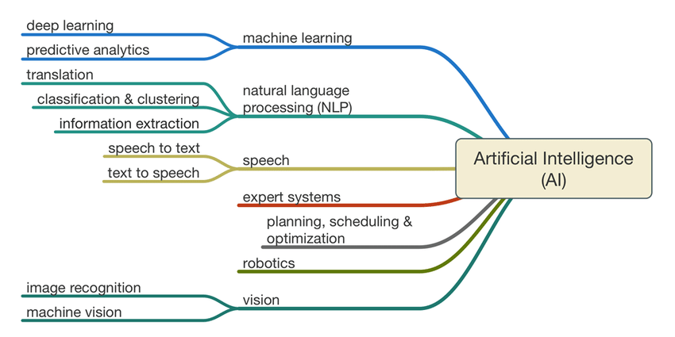]

.footnote[Image Source: [Marizel B. and Ma. Louella Salenga](https://www.researchgate.net/publication/324183626_Bitter_Melon_Crop_Yield_Prediction_using_Machine_Learning_Algorithm), 2018.]

---

class: middle

.center.width-90[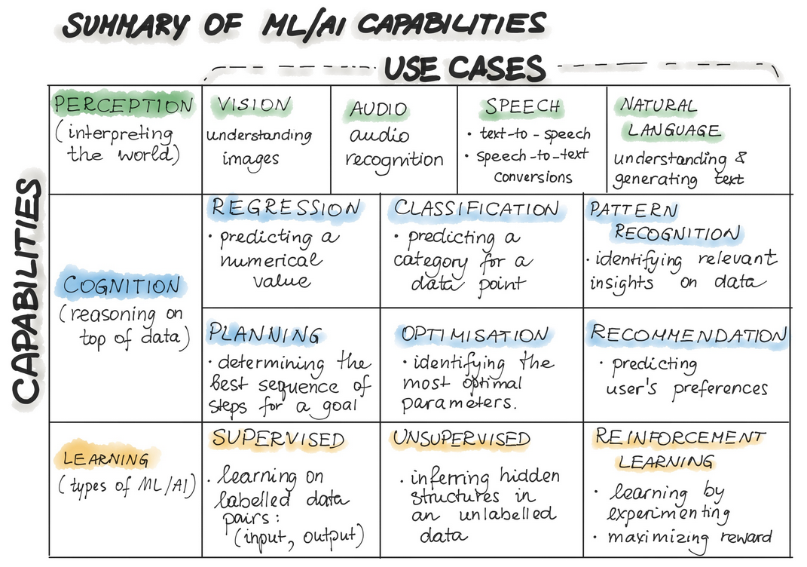]

.footnote[Image Source: [Why you Might Want to use Machine Learning](https://ml-ops.org/content/motivation).]

---

class: middle

.center.width-50[]

.quote["Подібно до того, як електрика змінила майже все 100 років тому, сьогодні мені важко уявити галузь, яку, на мою думку, ШІ не змінить у найближчі кілька років."]

.pull-right[&mdash; Ендрю Ин, 2017]

.footnote[Credits: [Andrew Ng: Artificial Intelligence is the New Electricity](https://www.youtube.com/watch?v=21EiKfQYZXc), 2017.]

---

class: middle

.center.width-90[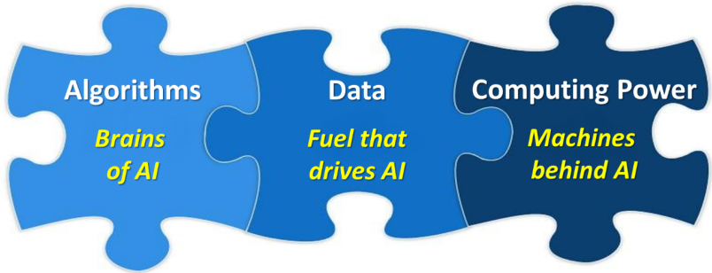]

.quote[Однією з найважливіших особливостей штучного інтелекту є те, що це багатоцільова технологія. Подібно до електрики, її можна застосовувати у різних сферах та для різних завдань.

*Алгоритми* вказують комп’ютерам, що робити. *Дані* визначають, що комп’ютери мають вчити.
*Обчислювальна потужність* надає машинам змогу навчатися та ухвалювати рішення.]

.footnote[Credits: [Microsoft](https://cdn-dynmedia-1.microsoft.com/is/content/microsoftcorp/microsoft/final/en-us/microsoft-brand/documents/2024-wttc-introduction-to-ai.pdf), 2024.]

---

class: blue-slide, middle, center
count: false

.larger-xx[Машинне навчання]

---

class: middle

.center[
.width-45[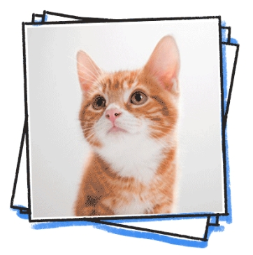] &nbsp; &nbsp;
.width-45[]
]

.question[Чи могли б ви написати комп’ютерну програму, яка розпізнає *котів* та *собак*?]

---

class: middle

.center.width-60[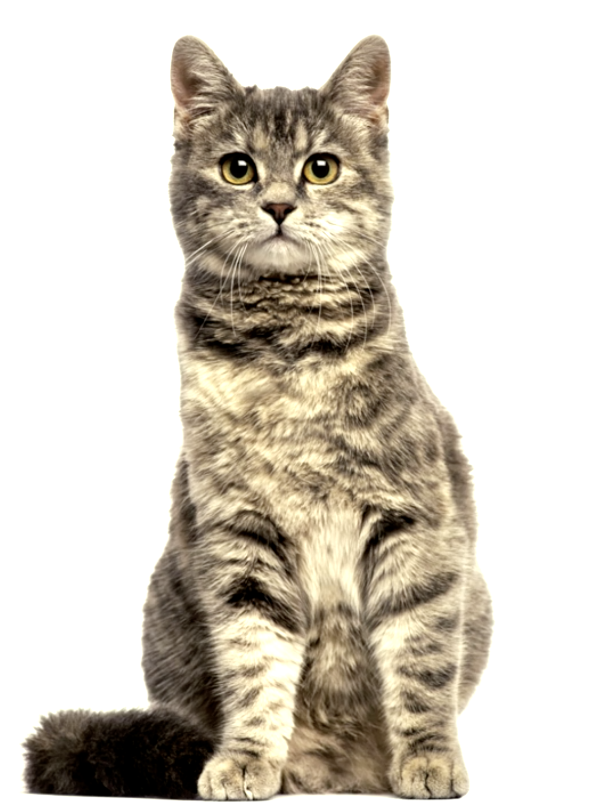]

---

count: false
class: middle

.center.width-60[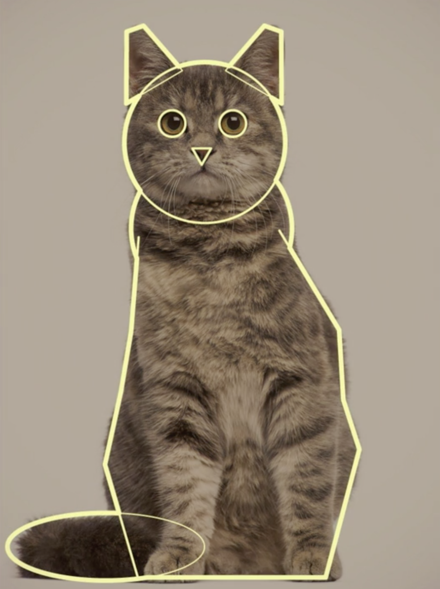]

---

count: false
class: black-slide, middle
background-image: url(figures/lec1/cat3.png)
background-size: cover

---

count: false
class: black-slide, middle

background-image: url(figures/lec1/cat4.png)
background-size: cover

---

count: false
class: middle

background-image: url(figures/lec1/cats.jpg)
background-size: contain

---

count: false
class: middle

background-image: url(figures/lec1/dogs.jpeg) 
background-size: contain

---

class: middle

Для пошуку шаблону в даних (витягування семантичної інформації, ознак) потрібна побудова **складних моделей**, які б отримати вручну було б дуже складно.

Однак, можна використати алгоритми машинного навчання, які будуть **учитись** знаходити шаблон у даних самостійно. 

---

class: middle

.center.width-100[]

.center[Підхід глибокого навчання]

---

class: middle

.center.width-100[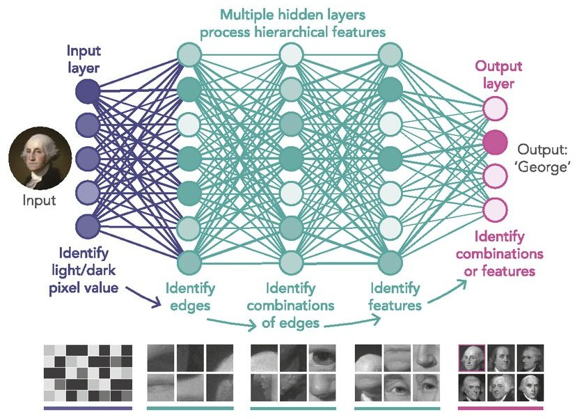]

---

class: middle, center

# Що таке машинне навчання?

---

class: middle

# Визначення за Артур Семюель

.center[
.width-100[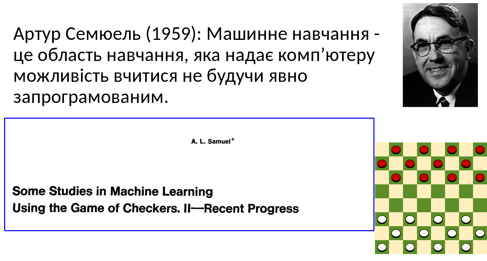]
]

---

class: middle

# Визначення за Том Мітчелл

Том Мітчелл (1998): Комп’ютерна програма, яка учиться з досвiду **E** по вiдношенню до деякого
класу задач **T** та мiри продуктивностi **P** називається машинним навчанням, якщо її продуктивнiсть у задачах
з **T**, що вимiрюється за допомогою **P**, покращується з досвiдом **E**.

.right[
.width-30[]
]

  - Досвід (дані): ігри в які грає програма сама з собою
  - Вимір продуктивності: коефіцієнт виграшу

---

class: middle

# Класичне програмування vs машинне навчання

.center[
.width-100[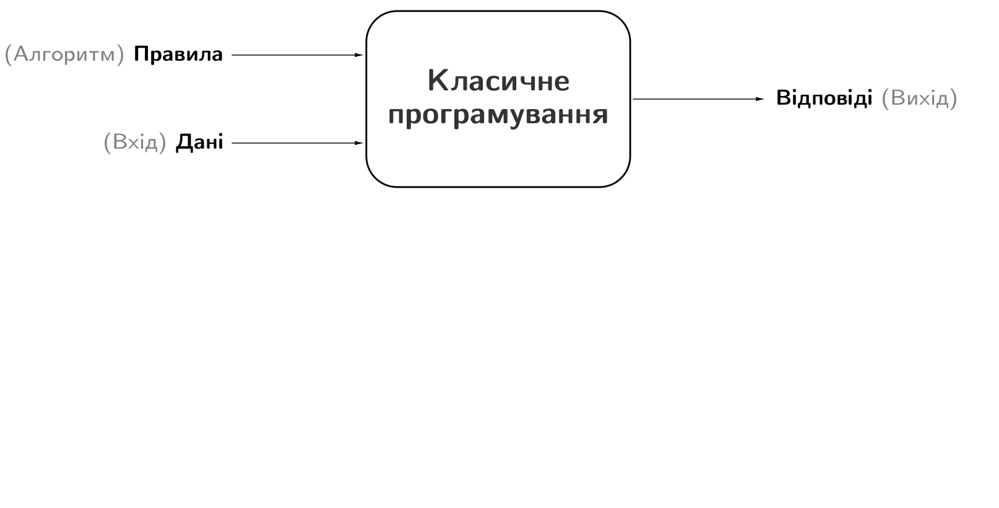]
]

???

Комп’ютери та обчислення допомагають нам досягати бiльш складних цiлей i кращих результатiв у вирiшеннi
проблем, нiж ми могли б досягти самi. Однак, багато сучасних завдань вийшли за рамки обчислень через один
основний обмежуючий фактор: традицiйно, комп’ютери можуть дотримуватися лише конкретних
вказiвок/iнструкцiй, якi їм дають.

Вирiшення проблем з програмування вимагає написання конкретних покрокових iнструкцiй, якi має виконувати комп’ютер. Ми називаємо цi кроки алгоритмами. У цьому випадку, комп’ютери можуть допомогти нам
там, де ми:
1. Розумiємо як вирiшити проблему.
2. Можемо описати проблему за допомогою чiтких покрокових iнструкцiй, якi комп’ютер може зрозумiти.

---

class: middle
count: false

# Класичне програмування vs машинне навчання

.center[
.width-100[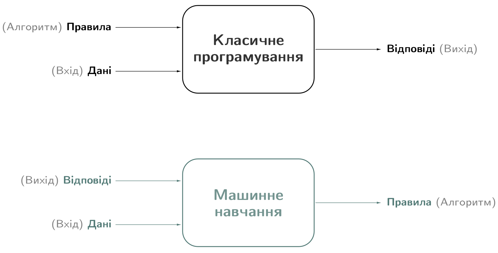]
]

???

Методи машинного навчання дозволяють комп’ютерам “учитися” на прикладах. Вирiшення проблем iз застосуванням машинного навчання вимагає виявлення деякого шаблону, а потiм, коли такий шаблон готовий, дозволяють, наприклад, нейроннiй мережi вивчити карту переходiв мiж вхiдними та вихiдними даними. Ця особливiсть вiдкриває новi типи проблем, де комп’ютери можуть допомогти нам у їх розв’язаннi, за умови, коли ми:
1. Визначили шаблон проблеми.
2. Маємо достатньо даних, що iлюструють шаблон.
---

class: middle

# Типи навчання

За характером навчальних даних (**досвiду**) машинне навчання подiляють на чотири типи: контрольоване (з учителем), напiвконтрольоване, неконтрольоване (без учителя) та з пiдкрiпленням.

.center[
.width-100[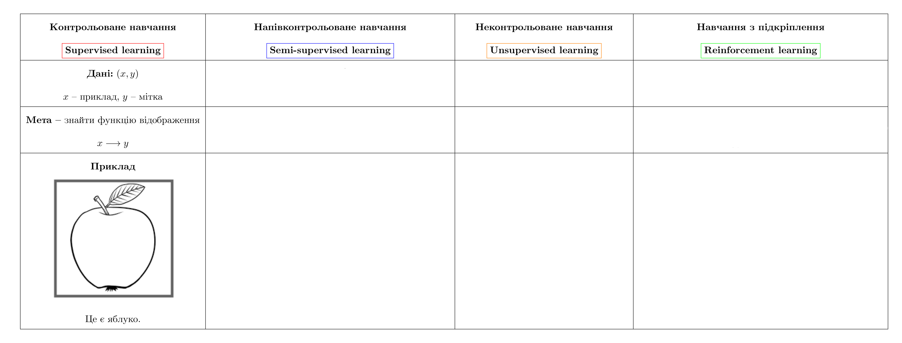]
]

---

class: middle
count: false

# Типи навчання

.center[
.width-100[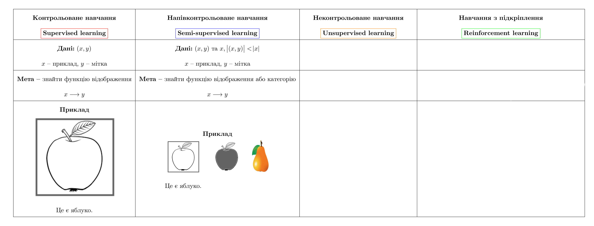]
]

---

class: middle
count: false

# Типи навчання

.center[
.width-100[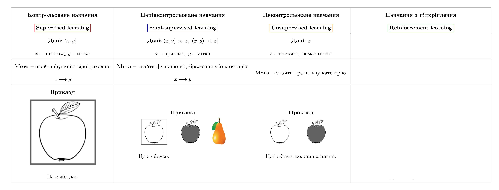]
]

---

class: middle
count: false

# Типи навчання

.center[
.width-100[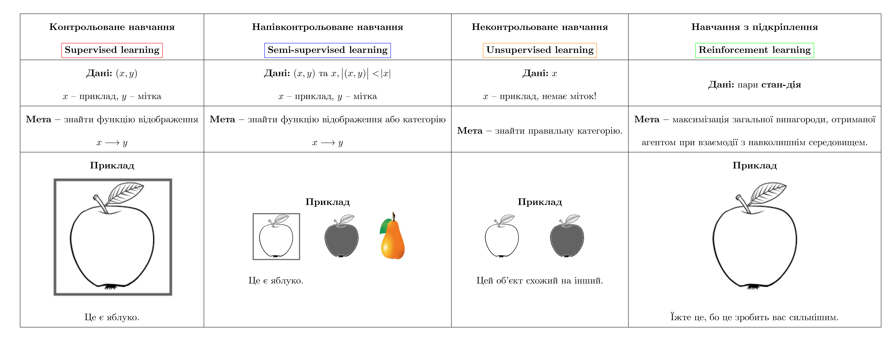]
]

---

class: middle

# Навчання з учителем
## Постановка задачі

Нехай $\mathbf{d} \sim p(\mathbf{X}, y)$ &mdash; датасет з $n$ пар прикладів вхід-вихід

 $$\mathbf{d} = \\{(\mathbf{X}^{(1)}, y^{(1)}), (\mathbf{X}^{(2)}, y^{(2)}),..., (\mathbf{X}^{(n)}, y^{(n)})\\},$$
де $\mathbf{X}^{(i)} = (x^{(i)}_1, x^{(i)}_2, ..., x^{(i)}_m)$ &mdash; вхідний вектор ознак,  $y^{(i)}$ &mdash; мітка (вихід), як правило, $y^{(i)} \in \mathbb{R}\ \text{або}\ y^{(i)} \in \mathbb{N}$.

На основі цих даних ми хочемо визначити статистичну модель $$p(y|\mathbf{X}),$$ яка буде найкраще пояснювати дані.

---

class: middle

# Вектор ознак

- Кожен вхідний приклад $\mathbf{X} \in \mathbb{R}^m$ &mdash; вектор вхідних ознак, який складається з $m$ атрибутів або ознак.
- Якщо дані спочатку не виражені як дійсні вектори, тоді їх потрібно підготувати та перетворити в цей формат.

---

# Лінійна регресія

Якщо $y \in \mathbb{R}$. 

.center.width-70[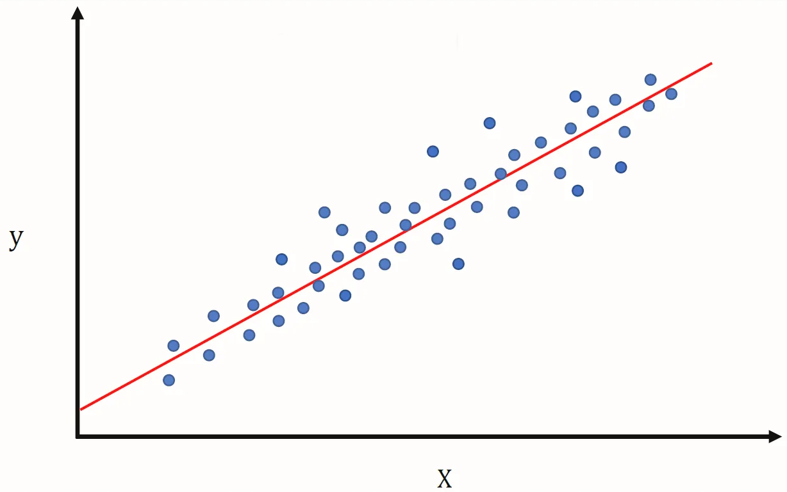]

$$\hat y  = W \cdot X + b$$

Алгоритм регресії прагне відшукати лінію чи гіперповерхню, яка найближче знаходиться до прикладів: $(\mathbf{X}^{(i)}, y^{(i)})$. Одновимірна регресія: $\mathbf{X}^{(i)} = (x^{(i)}_1)$

???
Y -- залежна змінна, і вона неперервна - наприклад, кількість продажів, ціна, вага. Це змінна, значення якої ми намагаємося передбачити. X - незалежна змінна. Ми використовуємо цю змінну для прогнозування значення Y.

---

courn: false
class: middle

# Лінійна регресія

## Втрати

$$L^{(i)}(\hat y,y)  =  \Big(\hat{y}^{(i)} -  y^{(i)} \Big)^2$$

.center.width-80[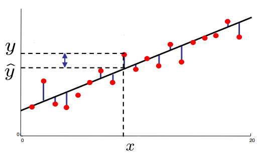]

---

courn: false
class: middle

# Лінійна регресія

## Цільова функція

$$J(\hat y,y)  = \frac{1}{n} \sum\_{i=1}^n L^{(i)} = \frac{1}{n} \sum\_{i=1}^n \Big(\hat{y}^{(i)} -  y^{(i)} \Big)^2$$
.center.width-70[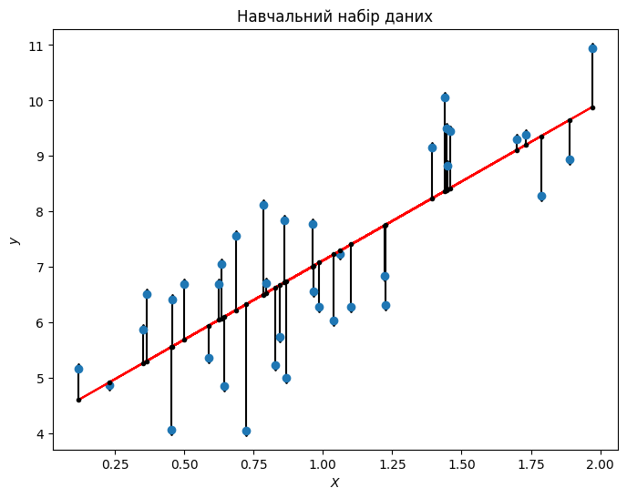]

Алгоритм регресії прагне відшукати лінію чи гіперповерхню, яка найближче знаходиться до прикладів: $(\mathbf{X}^{(i)}, y^{(i)})$. Одновимірна регресія: $\mathbf{X}^{(i)} = (x^{(i)}_1)$

???
Y -- залежна змінна, і вона неперервна - наприклад, кількість продажів, ціна, вага. Це змінна, значення якої ми намагаємося передбачити. X - незалежна змінна. Ми використовуємо цю змінну для прогнозування значення Y.

---

count: false
class: middle

# Лінійна регресія

.center.width-100[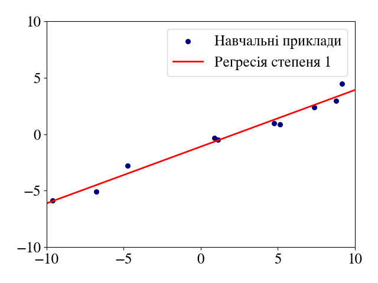]

---

class: middle

# Логістична регресія

Якщо $y \in \{0, 1\}$.

.center.width-40[]

$$\hat y  = \sigma(z) = \frac{1}{1 + \exp(-z)} = \frac{1}{1 + \exp(-(W \cdot X + b))}$$

У разі класифікації алгоритм навчання шукає лінію (або, у загальному випадку, гіперповерхню), яка розділяє приклади різних класів.

.footnote[Джерело зображення: [CS188](https://inst.eecs.berkeley.edu/~cs188/), UC Berkeley.]

---

class: middle
# Логістична регресія

## Втрати 

$$L^{(i)}(\hat y,y)  = -  \Big[ y^{(i)} \log(\hat{y}^{(i)}) + (1 - y^{(i)}) \log(1 - \hat{y}^{(i)}) \Big]$$

 

## Цільова функція

$$J(\hat y,y)  = \frac{1}{n} \sum\_{i=1}^n L^{(i)}=  - \frac{1}{n} \sum_{i=1}^n \Big[ y^{(i)} \log(\hat{y}^{(i)}) + (1 - y^{(i)}) \log(1 - \hat{y}^{(i)}) \Big]$$

---

class: middle

# Класифікація vs  регресія

.grid[
.kol-1-2[
.center.width-85[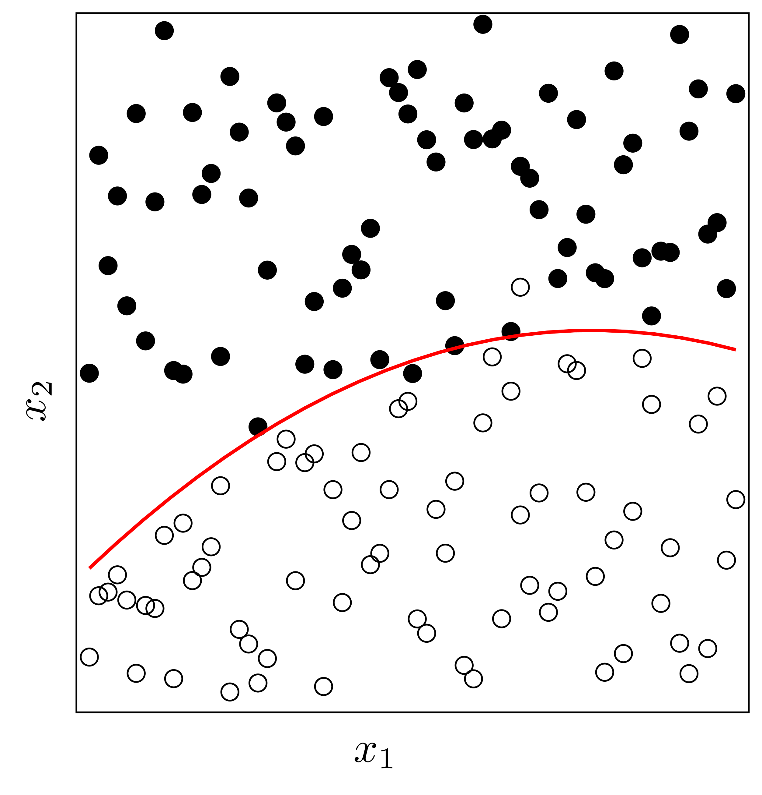]
.center[Класифікація]
]

.kol-1-2[
.center.width-95[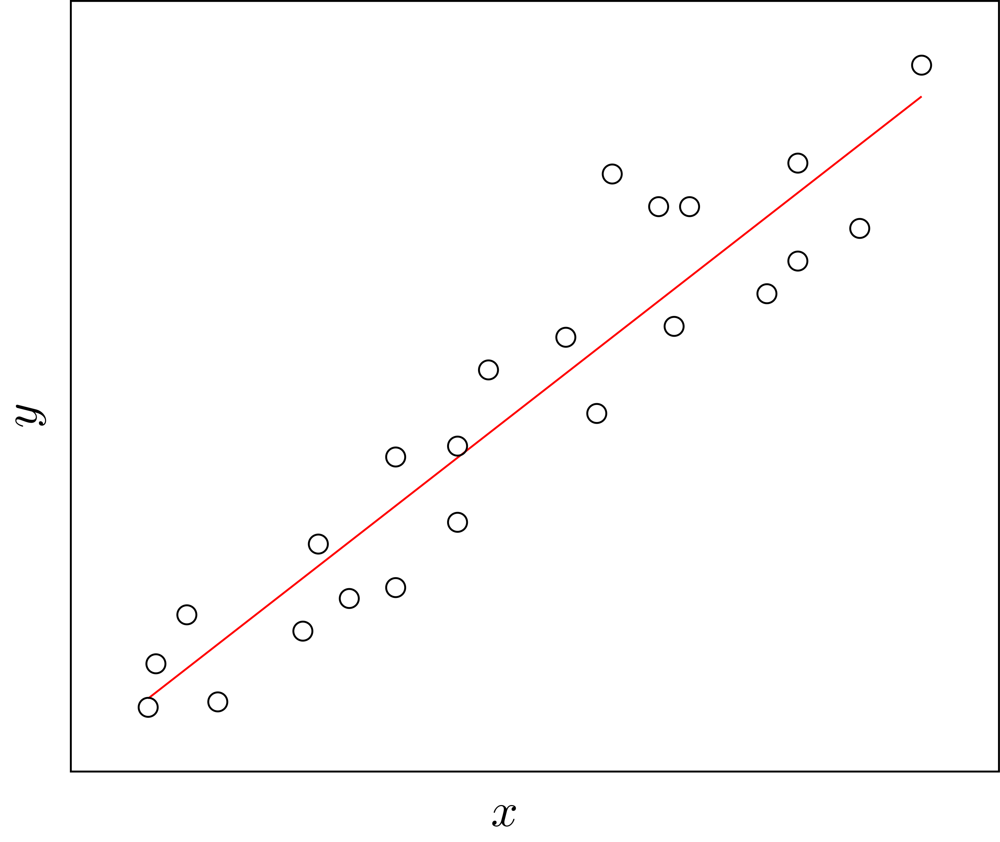]
.center[Регресія]
]]

---

class: middle

# Як вчиться людина?

- Ми та інші розумні істоти, вчимось завдяки **взаємодії із своїм оточенням**

- Взаємодії часто бувають **послідовними** - майбутні взаємодії можуть залежати від попередніх

- Ми направлені на **результат**

- Ми можемо вчитися **не маючи прикладів** оптимальної поведінки

???

Нейронні мережі, прекрасна біологічно натхненна парадигма програмування, яка дозволяє комп’ютеру навчатися на основі даних спостережень

---

class: middle

# Мозок людини

Базовою обчислювальною одиницею мозку є нейрон. Мозок дорослої людини складається з $86$ мiльярдiв нейронiв, якi з’єднанi між собою приблизно
$10^{14}$ − $10^{15}$ синапсами.

.footnote[Джерело: [F. A. Azevedo та ін.](https://onlinelibrary.wiley.com/doi/abs/10.1002/cne.21974), 2009.]

---

class: middle

# Біологічний та штучний нейрон

.center[
.width-100[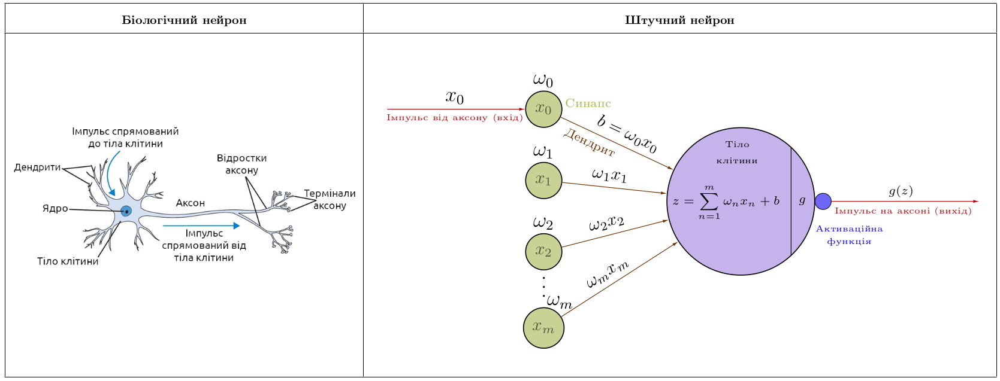]
]

---

class: middle,
# Деякі функції активації

.center[
.width-100[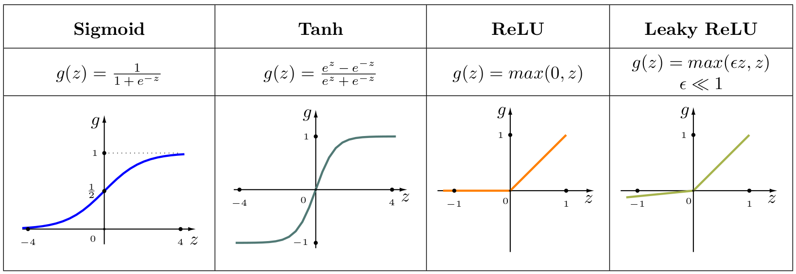]
]

---

class: middle

# Людина добре сприймати візуальну інформацію

---

class: middle, center

.width-100[]

Що Ви бачите?

???

.italic[Як Ви це робите?]

---

class: middle

.center[
.width-70[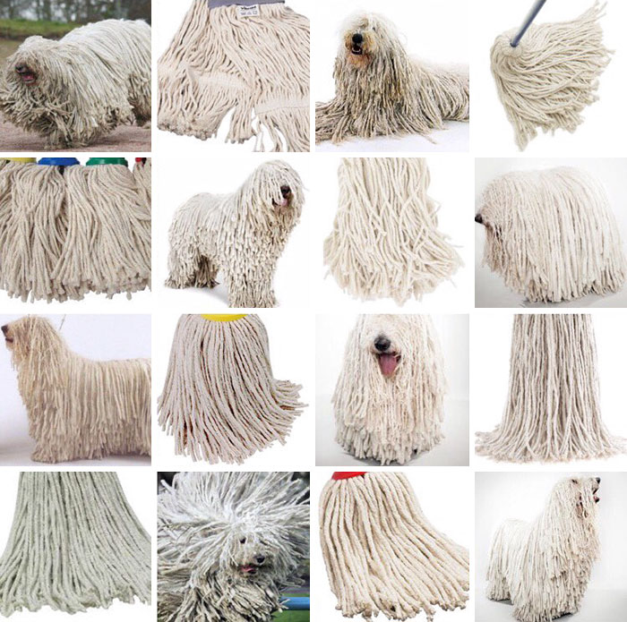]

Собака-вівця чи швабра?
]

---

class: middle

.center[
.width-70[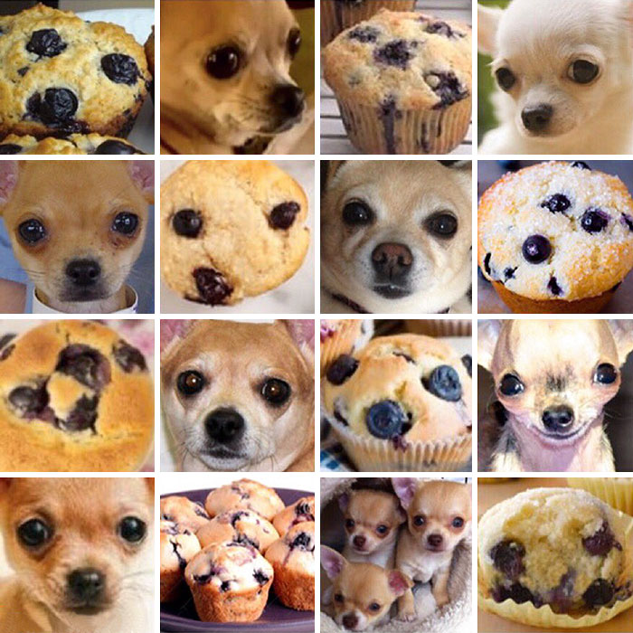]

Кекс чи собака?
]

---

class: middle

Людський мозок настільки добре інтерпретує візуальну інформацію, що **розрив** між зображенням та його семантичною інтерпретацією (пікселями) важко оцінити інтуїтивно: 

 
.center.width-20[]

---

class: middle, center

.width-80[]

---

class: middle, center

.width-30[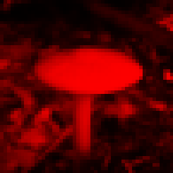] +
.width-30[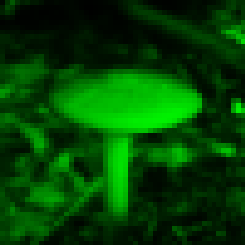] +
.width-30[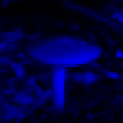]

---

class: middle, center

.width-80[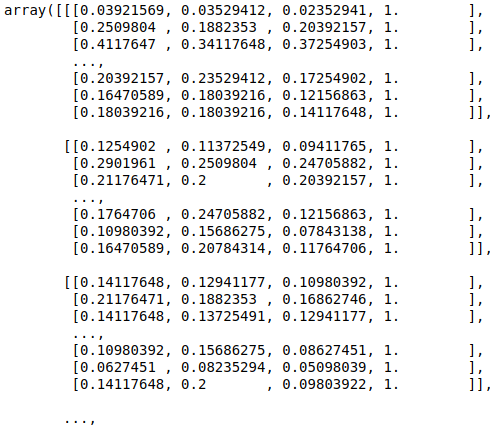]

Зображення гриба.

---

class: middle

# Що входить до задачі машинного навчання?

- Постановка проблеми + збір даних
- Навчання моделі
- Визначення функції втрат
- Вибір алгоритму оптимізації

---

class: middle

# Які дані використовуються?

.center.width-100[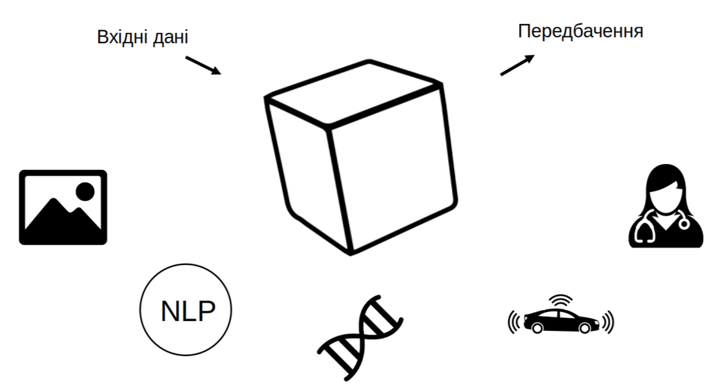]

---

class: middle

# Ознаки у машинному навчанні

Ознаки - це спостереження, які використовуються для прийняття рішень моделлю.

- Для класифікації зображень **кожен** піксель є ознакою
- Для розпізнавання голосу, **частота** та **гучність** є ознаками
- Для безпілотних автомобілів дані з **камер**, **радарів** і **GPS** є ознаками

---

class: middle

# Типи ознак у робототехніці

- Пікселі (RGB дані)
- Глибина (сонар, лазерні далекоміри)
- Орієнтація або прискорення (гіроскоп, акселерометр, компас)

---

class: middle

# Недонавчання vs перенавчання

.center.width-100[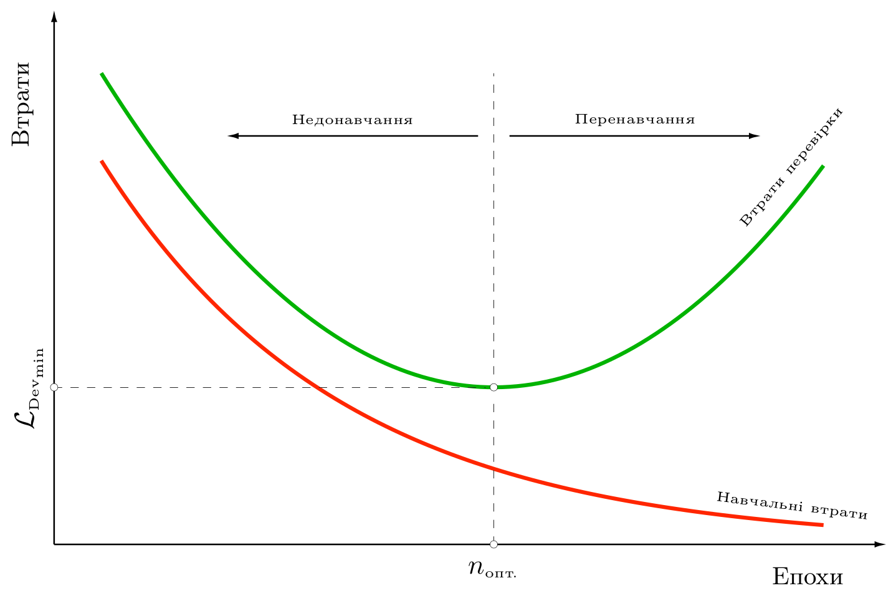]

---

class: middle
count: false

# Недонавчання vs перенавчання

.center.width-80[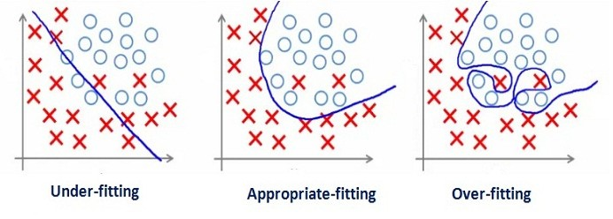]

---

class: middle

# Що таке модель?

Хоча те, що знаходиться всерединi глибинної нейронної мережi, може бути складним, за своєю суттю це просто функцiї. Вони беруть певнi вхiднi данi: **INPUT x** i
генерують деякi вихiднi данi: **OUTPUT f(x)**

.center.width-40[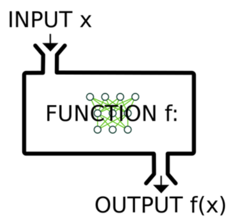]

---

class: middle, center

# Типи моделей

.bold[*Дискримінативні*]  та .bold[*генеративні*] моделі

.center.width-100[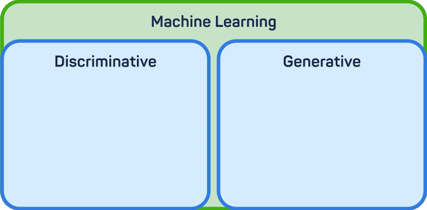]

---

# З чого складається модель?

.center.width-100[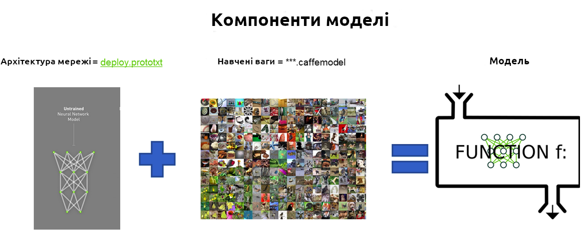]

---

# Джерела помилок моделі

- Зсув  (Bias)
- Розкид (Variance)
- Шум (Irreducible error)

$$Err = Bias^2 + Variance + Irreducible error$$

.center.width-70[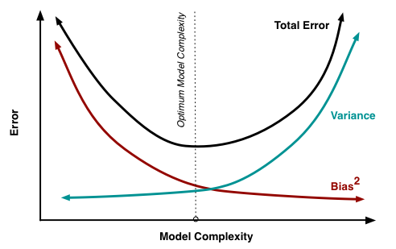]

---

# Інтуїція

  
.center.width-60[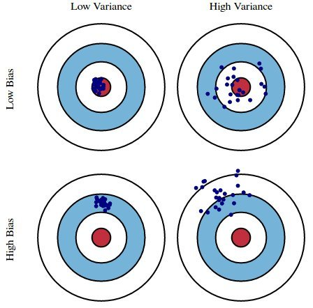]

---

# Інтуїція

## Великий зсув

  
.center.width-70[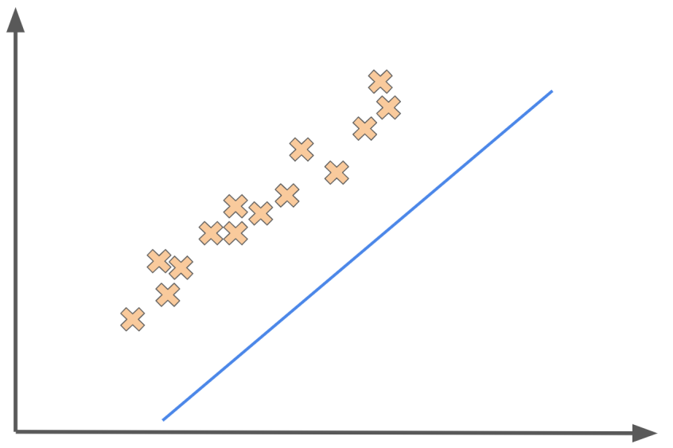]

---

class: blue-slide, middle, center
count: false

.larger-xx[Вплив ШІ]

---

class: middle

.center.width-10[]

## Переваги

- ШІ — це інструмент, здатний автоматизувати рутинні та виснажливі завдання.
- ШІ може розв’язувати складні задачі, які раніше ніхто не міг вирішити.
- Інтерфейс взаємодії людини з машиною радикально змінюється: розмовні асистенти роблять цифрові інструменти доступнішими.
- Прогрес відбувається шаленими темпами.

---

class: middle

.center.width-10[]

## Недоліки

- Моделі глибинного навчання є складними для інтерпретації, налаштування та пояснення їхньої внутрішньої логіки й прийнятих рішень.
- Системи штучного інтелекту можуть давати непередбачувані й навіть катастрофічні збої, попри демонстрацію високої точності.
- ШІ генерує значний обсяг низькоякісного контенту («AI-slop»), що засмічує інформаційний простір і знецінює результати людської творчої діяльності.
- Сучасні моделі глибинного навчання мають великі масштаби та потребують суттєвих обчислювальних ресурсів, що супроводжується значним екологічним впливом.

---

class: middle

.grid[
.kol-1-3[ .center.width-100[]]
.kol-2-3[.center.width-100[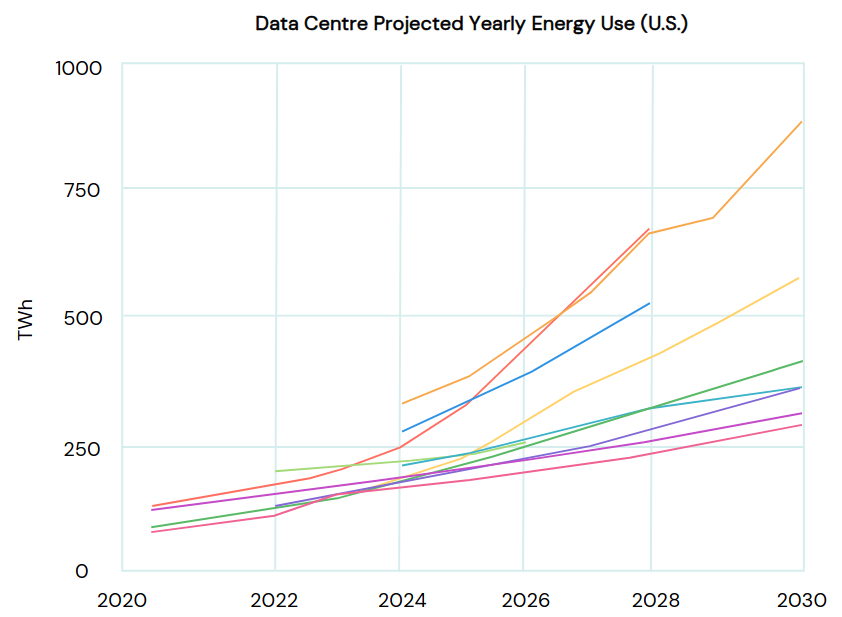]]
]

.quote.smaller-x[Штучний інтелект є помірним, але швидко зростаючим чинником глобального екологічного впливу через споживання енергії та викиди парникових газів (ПГ). За наявними оцінками, центри обробки даних і передавання даних становлять близько 1% світових викидів ПГ, пов’язаних з енергетикою, при цьому на ШІ припадає 10–28% енергоспоживання центрів обробки даних. Очікується, що попит на енергію для потреб ШІ суттєво зростатиме [...]]

.footnote[Credits: [Bengio et al.](https://arxiv.org/abs/2501.17805), 2025 (arXiv:2501.17805).]

---

class: middle

.center.width-10[]

## Ризики

- Моделі штучного інтелекту можуть бути носіями латентних упереджень, що реплікують або масштабують дискримінаційні патерни в даних.
- Спостерігається зростання випадків недобросовісного використання ШІ (створення діпфейків, аавтоматизовані боти, інструменти маніпулятивного впливу тощо).
- У різних секторах суспільства формується структурна залежність від ШІ, що супроводжується ризиками дегуманізації, втрати керованості процесами та деградації когнітивних компетентностей.

---

class: middle

.center.width-100[]

.quote[Студенти, які використовували ChatGPT під час написання есе у форматі SAT (Scholastic Assessment Test), продемонстрували найнижчі рівні мозкової активності. Крім того, їхні тексти ставали дедалі більш шаблонними, невиразними та позбавленими оригінальної думки. З часом студенти ставали більш пасивними й менш залученими до навчального процесу. Багато хто з них не міг пригадати, що саме написав, або відредагувати власну роботу без підтримки ШІ, що свідчить про те, що вони насправді .bold[не вчилися].]

.footnote[https://time.com/7295195/ai-chatgpt-google-learning-school/]

---

class: blue-slide, middle, center
count: false

.larger-xx[Сфери застосування та успіхи ШІ]

---

class: middle, center, black-slide

<iframe width="600" height="450" src="https://www.youtube.com/embed/5kpsZoKjPgQ" frameborder="0" allowfullscreen></iframe>

Виявлення об'єктів, визначення положення людини, сегментація (2019)

---

class: middle, center, black-slide

<iframe width="600" height="450" src="https://www.youtube.com/embed/hA_-MkU0Nfw" frameborder="0" allowfullscreen></iframe>

Створення автономних автомобілів (Waymo, 2022)

---

class: middle, black-slide, center

<iframe width="600" height="450" src="https://www.youtube.com/embed/zrcxLZmOyNA" frameborder="0" allowfullscreen></iframe>

Рушій для розвитку чистої енергії (NVIDIA, 2023)

---

class: middle, black-slide, center

<iframe width="600" height="450" src="https://www.youtube.com/embed/AbdVsi1VjQY" frameborder="0" allowfullscreen></iframe>

Як ШІ розвиває медицину (Google, 2023)

---

class: middle, center

.center.width-50[]

.center[Med-PaLM 2 (Google) &mdash; це велика мовна модель, налаштована для сфери медицини. Досягає 85%+ точності для запитань у стилі експертизи медичного професійного, три-етапного іспиту (USMLE).] 

???

Що відрізняє ці системи штучного інтелекту  так це те, що вони пропонують новий інтерфейс. ШІ більше не вбудований в інструменти, а знаходять у  прямому контакті з нами, людьми.  Наприклад, Med-PaLM 2 — це велика мовна модель, налаштована для сфери медицини. З ним можна взаємодіяти за допомогою природної мови, ніби ви розмовляєте з медичним експертом. Вам не потрібно знати, як писати код або як визначати ці математичні моделі. Ви просто задаєте запитання, і ця модель надасть вам відповідь.

---

class: middle, black-slide, center

<iframe width="600" height="450" src="https://www.youtube.com/embed/FASMejN_5gs" frameborder="0" allowfullscreen></iframe>

Інтерфейс «мозок-комп'ютер» перетворює нейронні сигнали на дії (Neuralink, 2025)

---

class: middle, black-slide

.center[
<video loop controls preload="auto" height="400" width="600">
  <source src="./figures/lec1/physics-simulation.mp4" type="video/mp4">
</video>

Симуляція фізики явищ (Sanchez-Gonzalez et al, 2020)

]

---

class: middle

## AlphaFold: Від послідовності амінокислот до 3D структури

.grid[
.kol-2-3.center.width-100[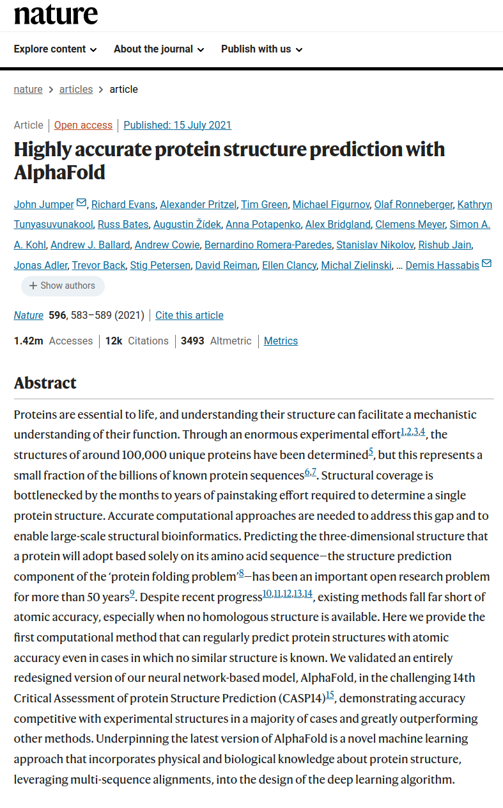]
.kol-1-3.center.width-80[]
.kol-1-3.circle.center.width-80[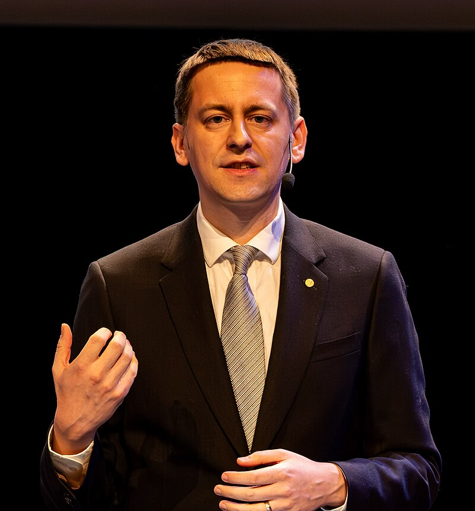 
.smaller-x[[John Jumper](https://en.wikipedia.org/wiki/John_M._Jumper)]  
.smaller-xx[(Нобелівська премія з хімії 2024)]]
.kol-1-4.circle.center.width-40[ ]

]

???

 AlphaFold &mdash; нейронна мережа, заснована на архітектурі трансформер, яка може передбачити тривимірну структуру білка за його амінокислотною послідовністю.

Ця проблема важлива, оскільки тривимірна структура білка визначає його функцію, а розуміння функції білка є ключовим для розуміння біології та розробки нових ліків.

Однак експериментальне визначення 3D-структури білка є складним і дорогим процесом, оскільки лише для визначення однієї структури потрібно кілька місяців.

AlphaFold став проривом у цій галузі та зміг передбачити тривимірну структуру білків з високою точністю всього за пару хвилин для найдовших послідовностей.

---

class: middle, black-slide, center

<iframe width="600" height="450" src="https://www.youtube.com/embed/gg7WjuFs8F4" frameborder="0" allowfullscreen></iframe>

ШІ для науки (Deepmind, AlphaFold, 2020)

---

class: middle

## Відкриття ліків за допомогою графових нейронних мереж

.center.width-80[]

???

Використання графових нейронних мереж для відкриття нових ліків.

Відкриття нових ліків є складною та дорогою проблемою пошуку, метою якої є пошук молекул, які зв’яжуться з цільовим білком і модулюватимуть його функцію. На жаль, ця проблема складна з двох причин:
-  по-перше, простір пошуку величезний - простір усіх можливих фармакологічно активних молекул оцінюється приблизно в $10^60$ молекул.
- по-друге, зв'язування молекули з білком є складним процесом, який важко змоделювати. Лабораторні експерименти необхідні для оцінки зв’язування молекули з білком, і ці експерименти є дорогими та трудомісткими.

Графові нейронні мережі стали проривом у цій галузі, і вони змогли передбачити властивості молекул з високою точністю.

У певному сенсі вони можуть слугувати віртуальною лабораторією, яку можна використовувати для попереднього скринінгу мільйонів молекул за лічені години, таким чином зводячи лабораторну роботу лише до найперспективніших кандидатів.

---

class: middle, center, black-slide

<iframe width="600" height="450" src="https://www.youtube.com/embed/7gh6_U7Nfjs" frameborder="0" allowfullscreen></iframe>

Синтез мовлення та відповіді на питання (Google, 2018)

---

class: middle, center, black-slide

<iframe width="600" height="450" src="https://www.youtube.com/embed/kSLJriaOumA" frameborder="0" allowfullscreen></iframe>

Генерація зображень (Karras et al, 2018)

---

class: middle, center, black-slide

<iframe width="600" height="450" src="https://www.youtube.com/embed/qTgPSKKjfVg" frameborder="0" allowfullscreen></iframe>

Генерація зображень і мистецтво ШІ (OpenAI, 2022)

---

class: middle, center, black-slide

<iframe width="600" height="450" src="https://www.youtube.com/embed/J_2fIGmsoRg" frameborder="0" allowfullscreen></iframe>

Reface оживив відомі київські мурали до Дня Києва (2021)

---

class: middle, center, black-slide

<iframe width="600" height="450" src="https://www.youtube.com/embed/Zm9B-DvwOgw" frameborder="0" allowfullscreen></iframe>

Написання комп’ютерного коду (OpenAI, 2021)

---

class: middle, center, black-slide

background-image: url(figures/lec1/ChatGPT.png)
background-size: contain

        
        
   

Відповісти на всі ваші запитання (OpenAI, 2022)

---

class: middle

.center.circle.width-30[]

.quote["Протягом останніх сорока років ми програмували комп’ютери; протягом наступних сорока років ми будемо їх навчати."]

.pull-right[&mdash; Крістофер Бішоп, 2020.] 
???
Крістофер Бішоп є технічним співробітником Microsoft і директором Microsoft Research AI4Science. Він також є почесним професором комп’ютерних наук Единбурзького університету та членом Дарвінівського коледжу в Кембриджі. У 2017 році він був обраний членом Королівського товариства.

---

class: middle

.center.width-100[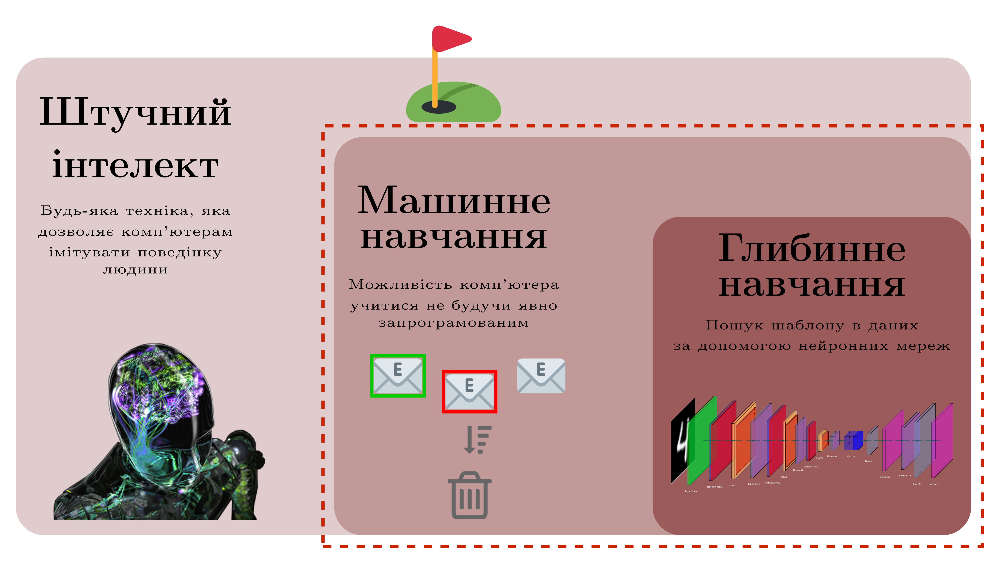]

---

class: end-slide, center
count: false

.larger-xxxx[🏁]

---

count: false

# Література

- Andriy Burkov (2020). [Machine Learning Engineering](http://www.mlebook.com/wiki/doku.php?id=start). Chapter 1: Introduction.
