class: middle, center, title-slide

# Машинне навчання

Лекція 2:  Cтатистичне навчання
  
Кочура Юрій Петрович 
[iuriy.kochura@gmail.com](mailto:iuriy.kochura@gmail.com)  
<a href="https://t.me/y_kochura">@y_kochura</a>  

---

class:  black-slide,
background-image: url(./figures/lec1/ml.png)

# Сьогодні
.larger-x[ 
 

🎙️ Навчання з учителем  
🎙️ Мінімізація емпіричного ризику   
🎙️ Недонавчання vs перенавчання  
🎙️ Компроміс зсуву та дисперсії  

]

---

class: blue-slide, middle, center
count: false

.larger-xx[Навчання з учителем]

Cтатистичне навчання

---

class: middle

# Модель

.center.width-50[]

???
Хоча те, що знаходиться всередині методу ML (наприклад, глибокої нейронної мережі), може бути складним, у своїй основі це просто функції. Вони приймають деякі вхідні дані та генерують деякі результати. Наприклад, модель ML для комп’ютерного зору може ідентифікувати автомобілі та пішоходів у відео в реальному часі. Модель — це математичне представлення об’єктів та їхніх зв’язків один з одним.

---

# Навчання з учителем

Розглянемо невідомий спільний розподіл ймовірності $p\_{X,Y}$

Припустимо, навчальна вибірка:
$$(\mathbf{X}^{(i)}, y^{(i)}) \sim p\_{X,Y}$$

???

У більшості випадків $\mathbf{X}^{(i)}$ є вектором, але це може бути зображення, фрагмент тексту або аудіофайл.

---

count: false
# Навчання з учителем

Розглянемо невідомий спільний розподіл ймовірності $p\_{X,Y}$

Припустимо, навчальна вибірка:
$$(\mathbf{X}^{(i)}, y^{(i)}) \sim p\_{X,Y}$$
де $\mathbf{X}^{(i)} \in \mathcal{X}$, $y^{(i)} \in \mathcal{Y}$, $i=1, ..., n$.

---

count: false
# Навчання з учителем

Розглянемо невідомий спільний розподіл ймовірності $p\_{X,Y}$

Припустимо, навчальна вибірка:
$$(\mathbf{X}^{(i)}, y^{(i)}) \sim p\_{X,Y}$$
де $\mathbf{X}^{(i)} \in \mathcal{X}$, $y^{(i)} \in \mathcal{Y}$, $i=1, ..., n$.

- У більшості випадків
    - $\mathbf{X}^{(i)} = (x^{(i)}_1, x^{(i)}_2, ..., x^{(i)}_m)$ &mdash;  $m$-вимірний вектор ознак або дескрипторів,
    - $y^{(i)}$ &mdash; скаляр (наприклад, категорія або дійсне значення).

---

count: false
# Навчання з учителем

Розглянемо невідомий спільний розподіл ймовірності $p\_{X,Y}$

Припустимо, навчальна вибірка:
$$(\mathbf{X}^{(i)}, y^{(i)}) \sim p\_{X,Y}$$
де $\mathbf{X}^{(i)} \in \mathcal{X}$, $y^{(i)} \in \mathcal{Y}$, $i=1, ..., n$.

- У більшості випадків
    - $\mathbf{X}^{(i)} = (x^{(i)}_1, x^{(i)}_2, ..., x^{(i)}_m)$ &mdash;  $m$-вимірний вектор ознак або дескрипторів,
    - $y^{(i)}$ &mdash; скаляр (наприклад, категорія або дійсне значення).
- Дані навчання згенеровано як незалежні та однаково розподілені випадкові величини

---

count: false
# Навчання з учителем

Розглянемо невідомий спільний розподіл ймовірності $p\_{X,Y}$

Припустимо, навчальна вибірка:
$$(\mathbf{X}^{(i)}, y^{(i)}) \sim p\_{X,Y}$$
де $\mathbf{X}^{(i)} \in \mathcal{X}$, $y^{(i)} \in \mathcal{Y}$, $i=1, ..., n$.

- У більшості випадків
    - $\mathbf{X}^{(i)} = (x^{(i)}_1, x^{(i)}_2, ..., x^{(i)}_m)$ &mdash;  $m$-вимірний вектор ознак або дескрипторів,
    - $y^{(i)}$ &mdash; скаляр (наприклад, категорія або дійсне значення).
- Дані навчання згенеровано як незалежні та однаково розподілені випадкові величини
- Навчальна вибірка може мати будь-який кінцевий розмір $n$.

---

count: false
# Навчання з учителем

Розглянемо невідомий спільний розподіл ймовірності $p\_{X,Y}$

Припустимо, навчальна вибірка:
$$(\mathbf{X}^{(i)}, y^{(i)}) \sim p\_{X,Y}$$
де $\mathbf{X}^{(i)} \in \mathcal{X}$, $y^{(i)} \in \mathcal{Y}$, $i=1, ..., n$.

- У більшості випадків
    - $\mathbf{X}^{(i)} = (x^{(i)}_1, x^{(i)}_2, ..., x^{(i)}_m)$ &mdash;  $m$-вимірний вектор ознак або дескрипторів,
    - $y^{(i)}$ &mdash; скаляр (наприклад, категорія або дійсне значення).
- Дані навчання згенеровано як незалежні та однаково розподілені випадкові величини
- Навчальна вибірка може мати будь-який кінцевий розмір $n$.
- У загальному випадку у нас немає жодної попередньої інформації про $p\_{X,Y}$.

---

# Висновок моделі

Навчання з учителем зазвичай стосується двох наступних типів задач логічного висновку моделі:
- .bold[Класифікація]
    - Дано $(\mathbf{X}^{(i)}, y^{(i)}) \in \mathcal{X}\times\mathcal{Y} = \mathbb{R}^m \times \bigtriangleup^C$, де $i=1, ..., n$
    - Ми хочемо оцінити для будь-якого нового $\mathbf{X}$: $$\boxed{\arg \max\_y p(Y=y|\mathbf{X})}$$

---

count: false

# Висновок моделі

Навчання з учителем зазвичай стосується двох наступних типів задач логічного висновку моделі:
- .bold[Класифікація]
    - Дано $(\mathbf{X}^{(i)}, y^{(i)}) \in \mathcal{X}\times\mathcal{Y} = \mathbb{R}^m \times \bigtriangleup^C$, де $i=1, ..., n$
    - Ми хочемо оцінити для будь-якого нового $\mathbf{X}$: $$\boxed{\arg \max\_y p(Y=y|\mathbf{X})}$$
- .bold[Регресія]
    - Дано $(\mathbf{X}^{(i)}, y^{(i)}) \in \mathcal{X}\times\mathcal{Y} =  \mathbb{R}^m \times \mathbb{R}$, де $i=1, ..., n$
    - Ми хочемо оцінити для будь-якого нового $\mathbf{X}$:  $$\mathbb{E}\left[ Y|\mathbf{X} \right]$$

???
Висновок машинного навчання – це процес подачі нових прикладів у навчену модель для обчислення виходу (прогнозу). Цей процес також називають «введенням в дію» або «запуском моделі машинного навчання у виробництво».

$\bigtriangleup^C$ is the simplex $\\{\mathbf{p} \in \mathbb{R}^C_+ : ||\mathbf{p}||_1 = 1\\}$

---

class: middle, center

.width-50[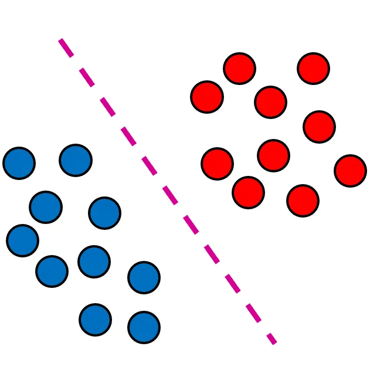]

Класифікація полягає у визначенні 
межі (границі) рішення між об’єктами різних класів.

???
У класифікації ми хочемо, щоб наша модель подивилась на вектор вхідних ознак, наприклад, значення пікселів зображення, а потім передбачала, до якої категорії (або іншими словами, класу) належить даний приклад. Для рукописних цифр ми можемо мати десять класів, що відповідають цифрам від 0 до 9. Найпростішою класифікацією є задача, коли маємо лише два класи, цю задачу прийнято називати бінарною класифікацією. Наприклад, наш набір даних може складатися із зображень тварин, а наші мітки можуть бути класами {cat, dog, bird}. 

Класифікація — це процес передбачення класу для вхідних прикладів даних. Класи іноді називають цілями/мітками або категоріями. 

---

class: middle, center

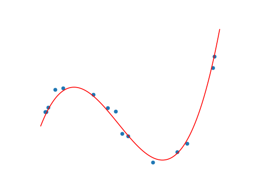

Регресія намагається оцінити в взаємозв'язок між скалярною (зазвичай неперервною) залежною змінною
та однією або кількома незалежними змінними.

Приклад: [Прогнозування цін на житло](https://towardsdatascience.com/predicting-house-prices-with-linear-regression-machine-learning-from-scratch-part-ii-47a0238aeac1)

???
Регресійна модель визначає зв’язок між незалежною змінною та залежною змінною за допомогою функції. Прогноз регресійного аналізу допомагає передбачити вплив незалежної змінної на залежну. 

Ex: Прогнозування цін на житло для продажу за допомогою лінійної регресії. Ми можемо побудувати таблицю, де кожен рядок відповідає окремому будинку, а кожен стовпець відповідає певному релевантному атрибуту, наприклад площі будинку, кількості спалень, кількості ванних кімнат і кількості хвилин (прогулянки). ) до центру міста.

---

class: middle

# Імовірнісна постановка задачі

Навчання з учителем можна формалізувати як імовірнісний висновок моделі, метою якого є оцінка умовного розподілу
$$p(Y=y|\mathbf{X})$$
для будь-якої нової пари $(\mathbf{X},y)$.

---

# Мінімізація емпіричного ризику

Традиційний підхід навчання з учителем полягає в мінімізації емпіричного ризику моделі.

Розглянемо функцію $f : \mathcal{X} \to \mathcal{Y}$, породжену деяким алгоритмом навчання. Якість прогнозів цієї моделі можна оцінити за допомогою функції втрат
$$\ell : \mathcal{Y} \times  \mathcal{Y} \to \mathbb{R},$$
де $\ell(y, f(\mathbf{X})) \geq 0$ вимірює, наскільки близьким є передбачення моделі $f(\mathbf{X})$ до епіричного значення $y$.

 
## Приклади функцій втрат

.grid[
.kol-1-3[Класифікація:]
.kol-2-3[$\ell(y,f(\mathbf{X})) = \mathbf{1}\_{y \neq f(\mathbf{X})}$]
]
.grid[
.kol-1-3[Регресія:]
.kol-2-3[$\ell(y,f(\mathbf{X})) = (y - f(\mathbf{X}))^2$]
]

???

Мінімізація емпіричного ризику (ERM) — це принцип у статистичній теорії навчання, який визначає сімейство алгоритмів навчання та використовується для встановлення теоретичних меж щодо ефективності цих алгоритмів.

---

class: middle

Нехай $\mathcal{F}$ &mdash; простір гіпотез, тобто множина усіх функцій $f$, які можуть бути породжені вибраним алгоритмом навчання.

Ми шукаємо функцію $f \in \mathcal{F}$ з невеликим **середнім ризиком** (або помилкою узагальнення)
$$R(f) = \mathbb{E}\_{(\mathbf{X},y)\sim p\_{X,Y}}\left[ \ell(y, f(\mathbf{X})) \right]$$

Це означає, що для заданого розподілу даних $p\_{X,Y}$, і для заданого простору гіпотез $\mathcal{F}$,
оптимальна модель
$$f\_\* = \arg \min\_{f \in \mathcal{F}} R(f)$$

---

class: middle

Оскільки $p\_{X,Y}$ невідомий, неможливо оцінити середній ризик і визначити оптимальну модель.

Однак, якщо ми маємо незалежні та однаково розподілені навчальні дані $\mathbf{d} = \\\{(\mathbf{X}^{(i)}, y^{(i)}) | i=1,\ldots,n\\\}$, ми можемо обчислити оцінку, **емпіричного ризику** (або помилку навчання)
$$\hat{R}(f, \mathbf{d}) = \frac{1}{n}  \sum\_{(\mathbf{X}^{(i)}, y^{(i)}) \in \mathbf{d}} \ell\bigg(y^{(i)}, f(\mathbf{X}^{(i)})\bigg)$$

Ця оцінка є *незміщеною* і може бути використана для знаходження достатньо хорошого наближення $f\_\*$. Це призводить до **принципу мінімізації емпіричного ризику**:
$$f\_\*^{\mathbf{d}} = \arg \min\_{f \in \mathcal{F}} \hat{R}(f, \mathbf{d})$$

???

Що означає незміщений?

=> Середня емпірична оцінка ризику (на наборі d) є середнім ризиком.

---

class: middle

Більшість алгоритмів машинного навчання, включаючи **нейронні мережі**, реалізують мінімізацію емпіричного ризику.

За законом великих чисел, мінімізація емпіричного ризику збігається:

$$\lim\_{n \to \infty} f\_\*^{\mathbf{d}} = f\_\*$$

???

Закон великих чисел в теорії імовірностей стверджує, що емпіричне середнє (арифметичне середнє) великої вибірки із фіксованого розподілу близьке до теоретичного середнього (математичного очікування) цього розподілу.

Ось чому налаштування параметрів моделі, щоб вона працювала на навчальних даних, є розумною справою.

---

# Поліноміальна регресія

.center.width-55[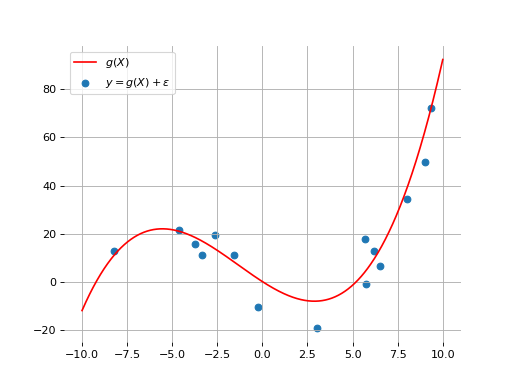]

Розглянемо спільний розподіл імовірностей $p\_{X,Y}$, породжений процесом генерування даних
$$(\mathbf{X},y) \sim p\_{X,Y} \Leftrightarrow \mathbf{X} \sim U[-10;10], \varepsilon \sim \mathcal{N}(0, \sigma^2), y = g(x) + \varepsilon$$
де $\mathbf{X} \in \mathbb{R}$, $y\in\mathbb{R}$ та $g$ &mdash; невідомий поліном степеня $3$.

---

class: middle

Наша .bold[мета] &mdash; знайти функцію $f$, яка робить в середньому хороші прогнози для розподілу $p\_{X,Y}$.

Розглянемо простір гіпотез $f \in \mathcal{F}$ для поліномів степеня $3$, визначених через навчальні параметри $\mathbf{w} \in \mathbb{R}^4$, наступним чином
$$\hat{y} \triangleq f(\mathbf{X}; \mathbf{w}) = \sum\_{d=0}^3 w\_d X^d$$  

---

class: middle

Для цієї задачі регресії ми використовуємо квадратичне відхилення як функцію втрат
$$\ell(y, f(x;\mathbf{w})) = (y - f(\mathbf{X};\mathbf{w}))^2$$
щоб визначити, наскільки помилковими є прогнози.

Тому нашою метою є знаходження найкращого значення $\mathbf{w}\_\*$ такого, що
$$\begin{aligned}
\mathbf{w}\_\* &= \arg\min\_\mathbf{w} R(\mathbf{w}) = \\\\
&= \arg\min\_\mathbf{w}  \mathbb{E}\_{(\mathbf{X},y)\sim p\_{X,Y}}\left[ (y-f(\mathbf{X};\mathbf{w}))^2 \right]
\end{aligned}$$

---

class: middle

Для досить великої навчальної вибірки $\mathbf{d} = \\\{(\mathbf{X}^{(i)}, y^{(i)}) | i=1,\ldots,n\\\}$ принцип мінімізації емпіричного ризику говорить нам, що гарну оцінку $\mathbf{w}\_\*^{\mathbf{d}}$ з $\mathbf{w}\_\*$ можна знайти шляхом мінімізації емпіричного ризику:
$$\begin{aligned}
\mathbf{w}\_\*^{\mathbf{d}} &= \arg\min\_\mathbf{w} \hat{R}(\mathbf{w},\mathbf{d}) = \\\\
&= \arg\min\_\mathbf{w} \frac{1}{n}  \sum\_{(\mathbf{X}^{(i)}, y^{(i)}) \in \mathbf{d}} (y^{(i)} - f(\mathbf{X}^{(i)};\mathbf{w}))^2 = \\\\
&= \arg\min\_\mathbf{w} \frac{1}{n}  \sum\_{(\mathbf{X}^{(i)}, y^{(i)}) \in \mathbf{d}} (y^{(i)} - \sum\_{d=0}^3 w\_d x^{d(i)})^2 =\\\\
&= \arg\min\_\mathbf{w} \frac{1}{n} \left\lVert
\underbrace{\begin{pmatrix} 
y^{(1)} \\\\
y^{(2)} \\\\
\ldots \\\\
y^{(n)}
\end{pmatrix}}\_{\mathbf{y}} -
\underbrace{\begin{pmatrix}
x^{0 (1)} \ldots x^{3 (1)} \\\\
x^{0 (2)} \ldots x^{3 (2)} \\\\
\ldots \\\\
x^{0 (n)} \ldots x^{3 (n)}
\end{pmatrix}}\_{\mathbf{X}}
\begin{pmatrix}
w\_0 \\\\
w\_1 \\\\
w\_2 \\\\
w\_3
\end{pmatrix}
\right\rVert^2
\end{aligned}$$

---

class: middle

Це **звичайна регресія за методом найменших квадратів**, для якої аналітичний розв’язок:

$$\mathbf{w}\_\*^{\mathbf{d}} = (\mathbf{X}^T\mathbf{X})^{-1}\mathbf{X}^T\mathbf{y}.$$

.center[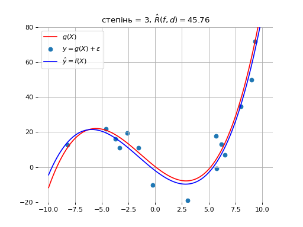]

???
Наведене вище рівняння для знаходження $\mathbf{w}\_\*^{\mathbf{d}}$, вирішує проблему квадратичної мінімізації лінійних функцій.

---

class: middle

Найкращим мінімізатором ризику $\mathbf{w}\_\*$ у просторі наших гіпотез є $g$.

Отже, ми можемо перевірити наступне:

$$f(X;\mathbf{w}\_\*^{\mathbf{d}}) \to f(X;\mathbf{w}\_\*) = g(X)$$ при $n \to \infty$

---

class: middle

.center[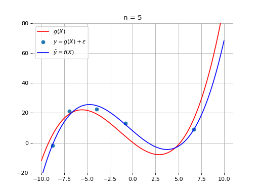]

---

class: middle
count: false

.center[]

---

class: middle
count: false

.center[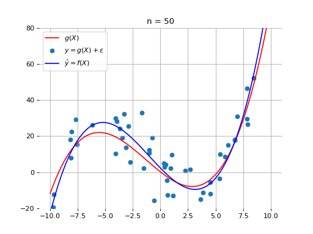]

---

class: middle
count: false

.center[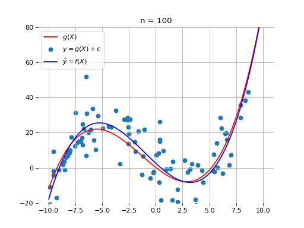]

---

class: middle
count: false

.center[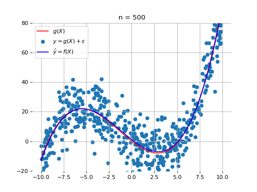]

---

class: middle

# Недонавчання vs перенавчання 

Що буде, якщо ми розглянемо простір гіпотез $\mathcal{F}$, у якому функції-кандидати $f$ або надто «прості», або надто «складні» по відношенню до справжнього розподілу даних?

.center.grid[
.kol-1-3[

.width-60[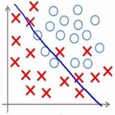]

.smaller-x.bold[Недонавчання]

.smaller-xx[Занадто проста модель, щоб пояснити розкид]

]
.kol-1-3[
    
..width-60[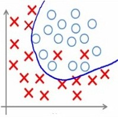]

.smaller-x.bold[Належний рівень навчання]

]
.kol-1-3[
    
.width-55[]

.smaller-x.bold[Перенавчання]

.smaller-xx[Занадто складна модель, враховує шум, замість взаємозв'язку, що лежить в основі даних]

]
]

---

class: middle

.center.width-60[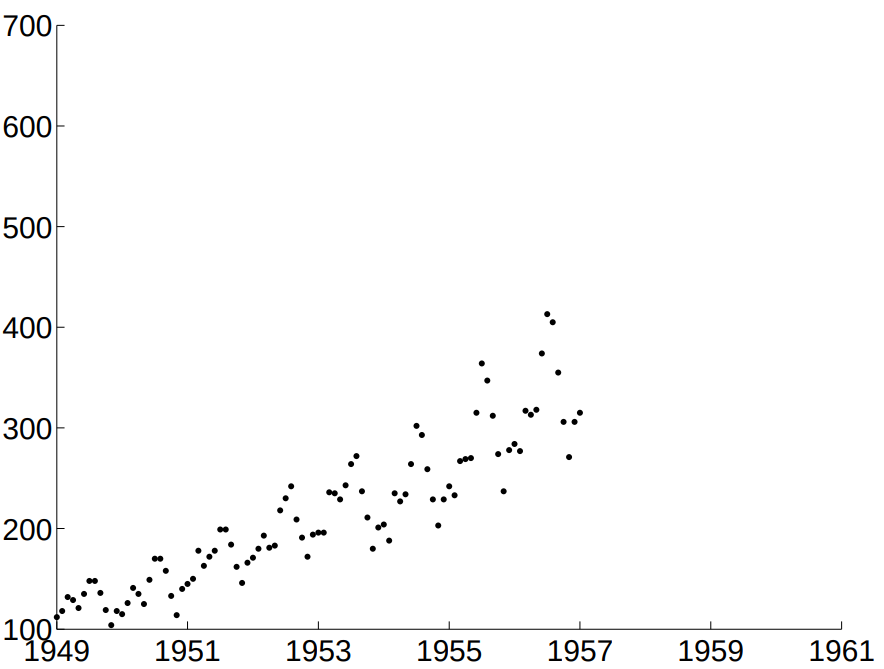]

## Яку модель Ви б обрали?

.grid[
.kol-1-3[

$f\_1(x) = w\_0 + w\_1 x$

]
.kol-1-3[
    
$f\_2(x) = \sum\_{j=0}^3 w\_j x^j$

]
.kol-1-3[
    
$f\_3(x) = \sum\_{j=0}^{10^4} w\_j x^j$

]
]

---

class: middle

.center[]

.center[$\mathcal{F}$ = поліноми степеня 1]

---

class: middle
count: false

.center[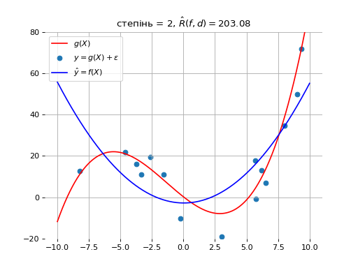]

.center[$\mathcal{F}$ = поліноми степеня 2]

---

class: middle
count: false

.center[]

.center[$\mathcal{F}$ = поліноми степеня 3]

---

class: middle
count: false

.center[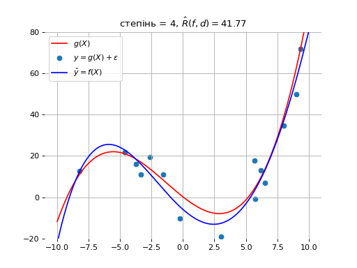]

.center[$\mathcal{F}$ = поліноми степеня 4]

---

class: middle
count: false

.center[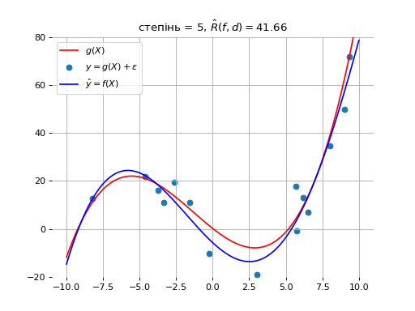]

.center[$\mathcal{F}$ = поліноми степеня 5]

---

class: middle
count: false

.center[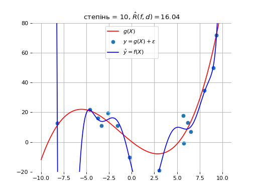]

.center[$\mathcal{F}$ = поліноми степеня 10]

---

class: middle, center

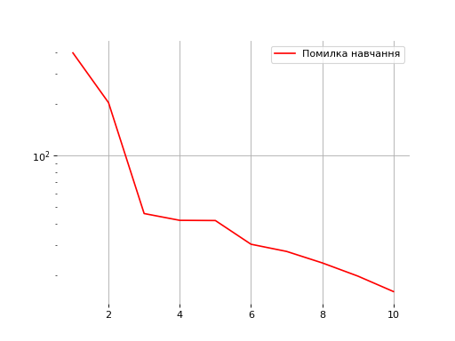

 Cтепінь поліному VS помилка навчання

???

Чому б нам не вибрати найбільший степінь поліному?

---

class: middle

Нахай $\mathcal{Y}^{\mathcal X}$ &mdash; множина усіх функцій $f : \mathcal{X} \to \mathcal{Y}$.

Ми визначаємо **ризик Байєса** як мінімальний очікуваний ризик для всіх можливих функцій
$$R\_B = \min\_{f \in \mathcal{Y}^{\mathcal X}} R(f),$$
і назваємо **оптимальною моделлю Байєса** модель $f_B$, яка досягає цього мінімуму.

Жодна модель $f$ не може працювати краще, ніж $f\_B$.

---

class: middle

**Потужність** простору гіпотез, породженого алгоритмом навчання, інтуїтивно представляє здатність знайти хорошу модель $f \in \mathcal{F}$ для будь-якої функції, незалежно від її складності.

На практиці потужністю можна управляти за допомогою гіперпараметрів алгоритму навчання. Наприклад:
- Степенем полінома;
- Числом прихованих шарів нейронної мережі;
- Кількістю ітерацій навчання (епохами);
- Виразами регуляризації.

---

class: middle

- Якщо потужність $\mathcal{F}$ дуже мала, тоді $f\_B \notin \mathcal{F}$ і $R(f) - R\_B$ дуже велика для будь-якої $f \in \mathcal{F}$, включаючи $f\_\*$ and $f\_\*^{\mathbf{d}}$. Кажуть, що такі моделі $f$ **недостатньо відповідають** даним (недонавчені).
- Якщо потужність $\mathcal{F}$  дуже велика, тоді $f\_B \in \mathcal{F}$ і $R(f\_\*) - R\_B$ дуже мала. 
Однак через високу потужність простору гіпотез мінімізатор емпіричного ризику $f\_\*^{\mathbf{d}}$ міг як завгодно добре відповідати навчальним даним, так що $$R(f\_\*^{\mathbf{d}}) \geq R\_B \geq \hat{R}(f\_\*^{\mathbf{d}}, \mathbf{d}) \geq 0$$
У цій ситуації $f\_\*^{\mathbf{d}}$ стає надто спеціалізованою до справжнього процесу генерування даних (розподілу даних) , і значне зменшення емпіричного ризику (часто) відбувається за рахунок збільшення очікуваного ризику .
У цій ситуації кажуть, що $f\_\*^{\mathbf{d}}$ **враховує шум, замість взаємозв'язку, що лежить в основі даних** (перенавчена модель).

---

class: middle

Наша мета полягає в тому, щоб налаштувати потужність простору гіпотез таким чином, щоб знайти оптимальну складність моделі та досягти якомога меншого очікуваного ризику.

.center[]

???

 Для глибоких нейронних мереж помилка навчання може досягати 0, тоді як помилка узагальнення може зростати!

---

class: middle

У випадку перенавчання,
$$R(f\_\*^{\mathbf{d}}) \geq R\_B \geq \hat{R}(f\_\*^{\mathbf{d}}, \mathbf{d}) \geq 0$$

Це свідчить, що емпіричний ризик $\hat{R}(f\_\*^{\mathbf{d}}, \mathbf{d})$ є поганою оцінкою для очікуваного ризику $R(f\_\*^{\mathbf{d}})$.

Тим не менш, незміщену оцінку очікуваного ризику можна отримати шляхом оцінки $f\_\*^{\mathbf{d}}$ на тестових даних $\mathbf{d}\_\text{test}$ незалежно від навчальної вибірки $\mathbf{d}$:
$$\hat{R}(f\_\*^{\mathbf{d}}, \mathbf{d}\_\text{test}) =  \frac{1}{n} \sum\_{(\mathbf{X}^{(i)}, y^{(i)}) \in \mathbf{d}\_\text{test}} \ell(y^{(i)}, f\_\*^{\mathbf{d}}(\mathbf{X}^{(i)}))$$

Ця величина **помилки тестування** може бути використана для оцінки фактичної продуктивності моделі. Однак не слід використовувати тестову вибірку одночасно з навчальною вибіркою на етапі вибору моделі.

---

class: middle, center

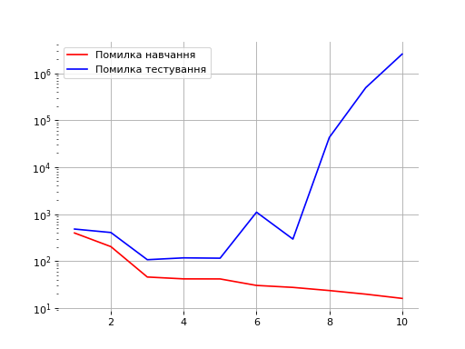

Степінь полінома VS. Помилки

???

Яке степінь поліному вибрати?

Але тоді наскільки хороша ця обрана модель?

---

class: middle

.center.width-100[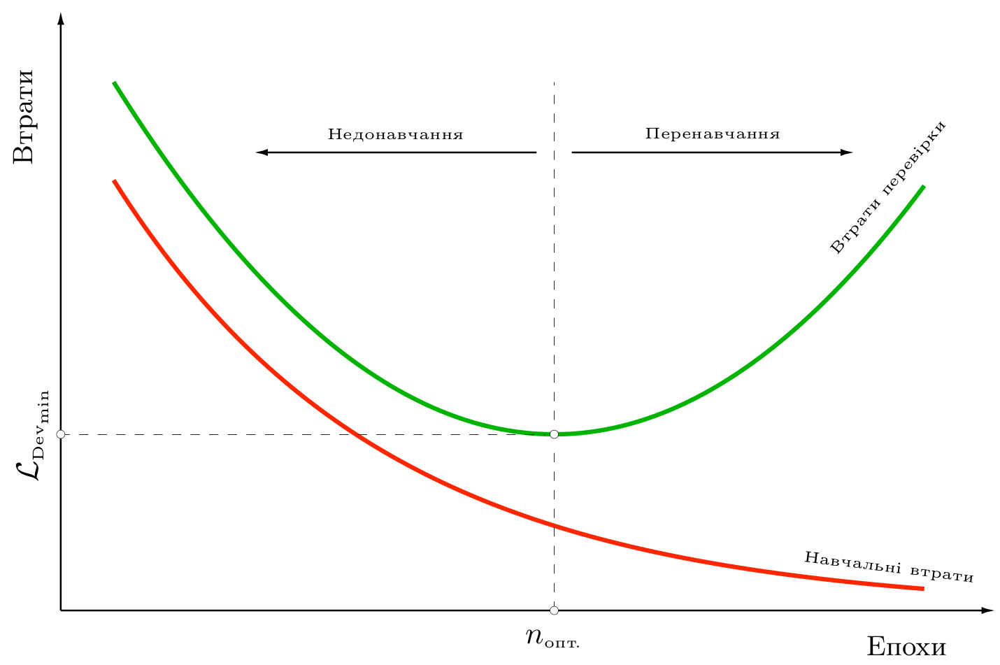] 

---

# Компроміс зсуву та дисперсії

Розглянемо фіксовану точку $x$ і прогноз $\hat{y}=f\_*^\mathbf{d}(x)$ емпіричного мінімізатора ризику для довільного фіксованого $x$.

Тоді локальний очікуваний ризик $f\_\*^{\mathbf{d}}$ дорівнює:
$$\begin{aligned}
R(f\_\*^{\mathbf{d}}|x) &= \mathbb{E}\_{y \sim p\_{Y|x}} \left[ (y - f\_\*^{\mathbf{d}}(x))^2 \right] = \\\\
&= \mathbb{E}\_{y \sim p\_{Y|x}} \left[ (y - f\_B(x) + f\_B(x) - f\_\*^{\mathbf{d}}(x))^2 \right] = \\\\
&= \mathbb{E}\_{y \sim p\_{Y|x}} \left[ (y - f\_B(x))^2 \right] + \mathbb{E}\_{y \sim p\_{Y|x}} \left[ (f\_B(x) - f\_\*^{\mathbf{d}}(x))^2 \right] = \\\\
&= R(f\_B|x) + (f\_B(x) - f\_\*^{\mathbf{d}}(x))^2
\end{aligned}$$
де
- $R(f\_B|x)$ &mdash; локальний очікуваний ризик моделі Байєса. Цей тип помилки не можа жодним чином зменшити.
- $(f\_B(x) - f\_\*^{\mathbf{d}}(x))^2$ представляє розбіжність між $f\_B$ та $f\_\*^{\mathbf{d}}$.

---

class: middle

Якщо $\mathbf{d} \sim p\_{X,Y}$  розглядається як випадкова змінна, тоді $f\_*^\mathbf{d}$ &mdash; також є випадковою змінною разом із її прогнозами $\hat{y}$.

---

class: middle

.center[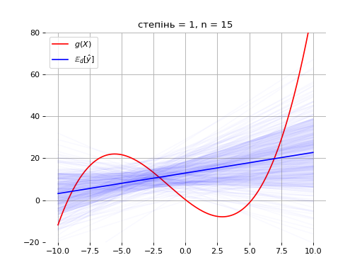]

---

class: middle
count: false

.center[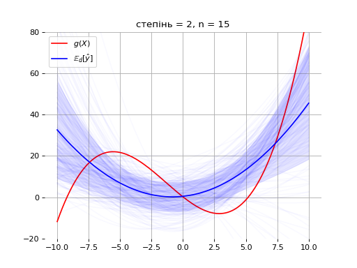]

---

class: middle
count: false

.center[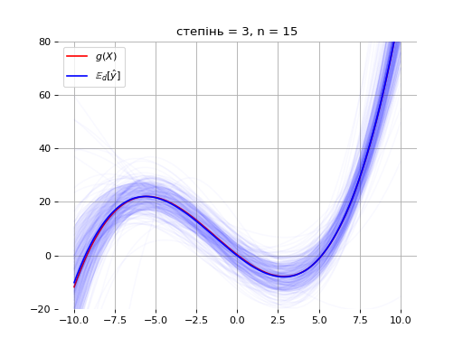]

---

class: middle
count: false

.center[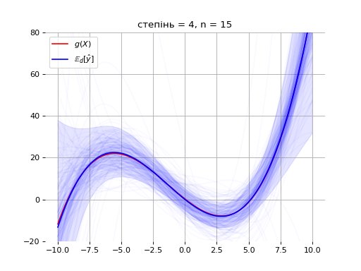]

---

class: middle
count: false

.center[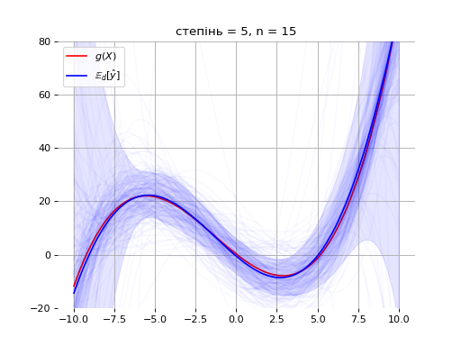]

---

class: middle

Формально середній локальний очікуваний ризик зведеться:
$$\begin{aligned}
&\mathbb{E}\_\mathbf{d} \left[ R(f\_\*^{\mathbf{d}}|x) \right] \\\\
&= \mathbb{E}\_\mathbf{d} \left[ R(f\_B|x) + (f\_B(x) - f\_\*^{\mathbf{d}}(x))^2 \right]  \\\\
&=  R(f\_B|x) + \mathbb{E}\_\mathbf{d} \left[ (f\_B(x) - f\_\*^{\mathbf{d}}(x))^2 \right] \\\\
&= \underbrace{R(f\_B|x)}\_{\text{noise}(x)} + \underbrace{(f\_B(x) - \mathbb{E}\_\mathbf{d}\left[ f\_\*^\mathbf{d}(x) \right] )^2}\_{\text{bias}^2(x)}  + \underbrace{\mathbb{E}\_\mathbf{d}\left[ ( \mathbb{E}\_\mathbf{d}\left[ f\_\*^\mathbf{d}(x) \right] - f\_\*^\mathbf{d}(x))^2 \right]}\_{\text{var}(x)}
\end{aligned}$$

Цей запис відомий як компроміс **зміщення-дисперсія**.

---

class: middle

## Інтуіція

.center[]

---

class: blue-slide, middle, center
count: false

.larger-xx[[Демо]()]

---

class: end-slide, center
count: false

.larger-xx[Кінець]

