class: middle, center, title-slide

# Машинне навчання

Лекція 5:   Метод найближчих сусідів
  
Кочура Юрій Петрович 
[iuriy.kochura@gmail.com](mailto:iuriy.kochura@gmail.com)  
<a href="https://t.me/y_kochura">@y_kochura</a>  

---

class:  black-slide,
background-image: url(./figures/lec1/ml.png)

# Сьогодні
.larger-x[ 
 

🎙️ Навчання з учителем  
🎙️ Мінімізація емпіричного ризику   
🎙️ Недонавчання vs перенавчання  
🎙️ Компроміс зсуву та дисперсії  

]

---

class: blue-slide, middle, center
count: false

.larger-xx[k-найближчих сусідів]

k-nearest neighbors (kNN)

---

class: middle

# 1-найближчий сусід

.center.width-70[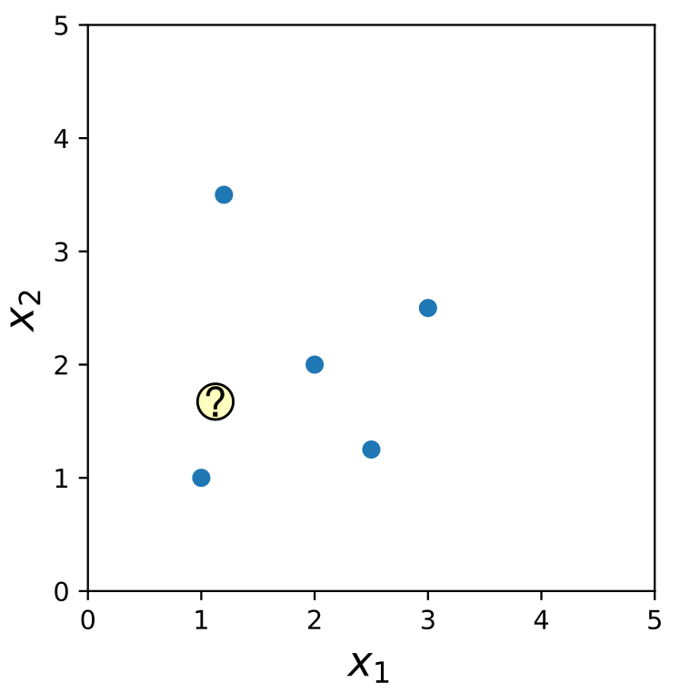]

.footnote[Автор: [Sebastian Raschka](https://sebastianraschka.com/)]

---

class: middle

# 1-найближчий сусід

.center.width-100[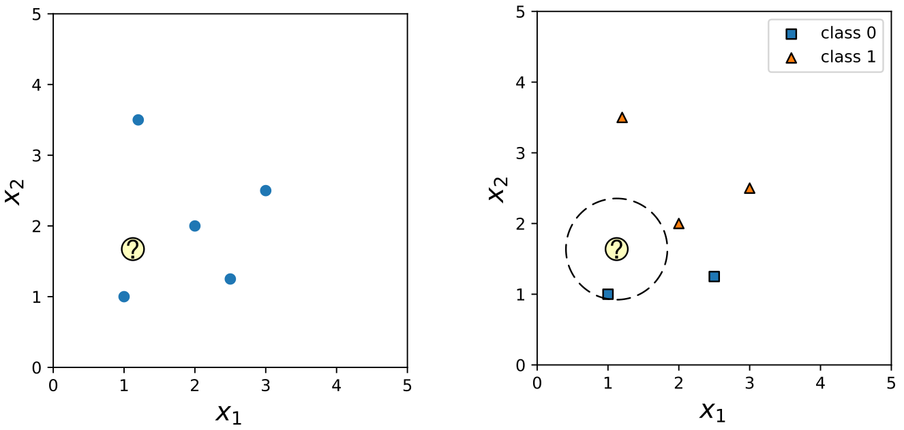]

.footnote[Автор: [Sebastian Raschka](https://sebastianraschka.com/)]

---

class: middle

# Навчальна вибірка

 .larger-xx[$$\\\{\bigg(\mathbf{X}^{(i)}, y^{(i)} \bigg) \in  \mathcal{D}, \\\}$$]
 .larger-xx[$$\\\{|\mathcal{D}| = n\\\}$$]

---

# Пвсевдокод: 1-найближчий сусід

closest_point := None

closest_distance := $\infty$
 - for $i=1, ..., n$:

     current_distance := $d(\mathbf{X}^{(i)}, \mathbf{X}^{(q)})$

     if current_distance $<$ closest_distance: 

    - closest_distance := current_distance

    - closest_point := $\mathbf{X}^{(i)}$
- return $f(\mathbf{X}^{(i)})$

Мітка найближчого сусіда (closest_point): $\bigg(\mathbf{X}^{(i)}, f\big(\mathbf{X}^{(i)}\big)\bigg)$

---

class: middle

# Евклідова відстань (L2)

.larger-xs[$$\begin{aligned}d\big(\mathbf{X}^{(a)}, \mathbf{X}^{(b)}) &= \sqrt{\sum\_{j=1}^m \left(\mathbf{X}_j^{(a)} - \mathbf{X}_j^{(b)}\right)^2} = \\\\ 
&= \left \Vert \mathbf{X}^{(a)} - \mathbf{X}^{(b)} \right \Vert\_2\end{aligned}$$]

де $\mathbf{X}^{(i)} = (x^{(i)}_1, x^{(i)}_2, ..., x^{(i)}_m) \in \mathbb{R}^m$ &mdash; $m$-вимірний вектор ознак.
 
---

class: blue-slide, middle, center
count: false

.larger-xx[Граница рішень методу найближчих сусідівв]

---

class: middle

# Границя рішень між (a) та (b)

.center.width-70[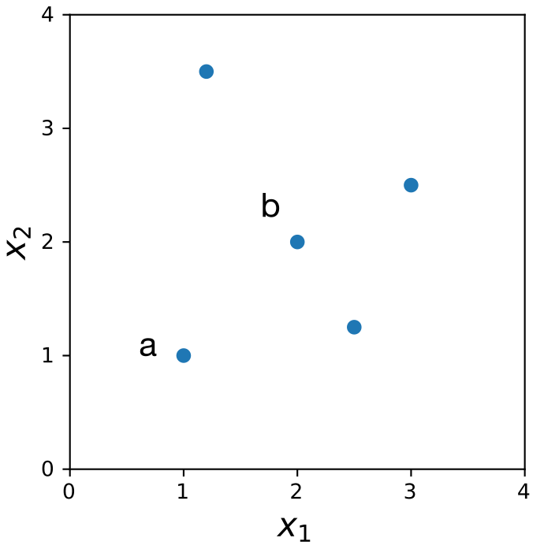]

.footnote[Автор: [Sebastian Raschka](https://sebastianraschka.com/)]

---

class: middle

# Границя рішень між (а) та (c)

.center.width-70[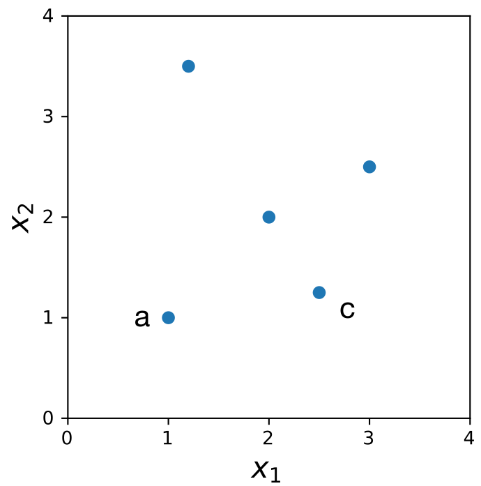]

.footnote[Автор: [Sebastian Raschka](https://sebastianraschka.com/)]

---

class: middle

# Границя рішень між (c) та (d)

.center.width-70[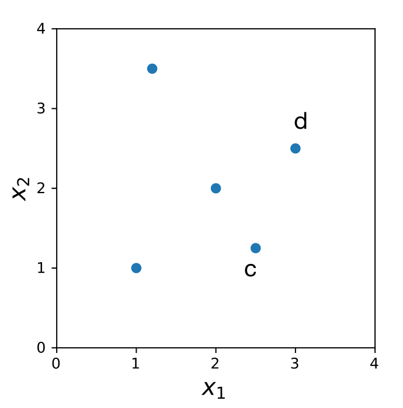]

.footnote[Автор: [Sebastian Raschka](https://sebastianraschka.com/)]

---

class: middle

# Границя рішень для 1-NN

.center.width-75[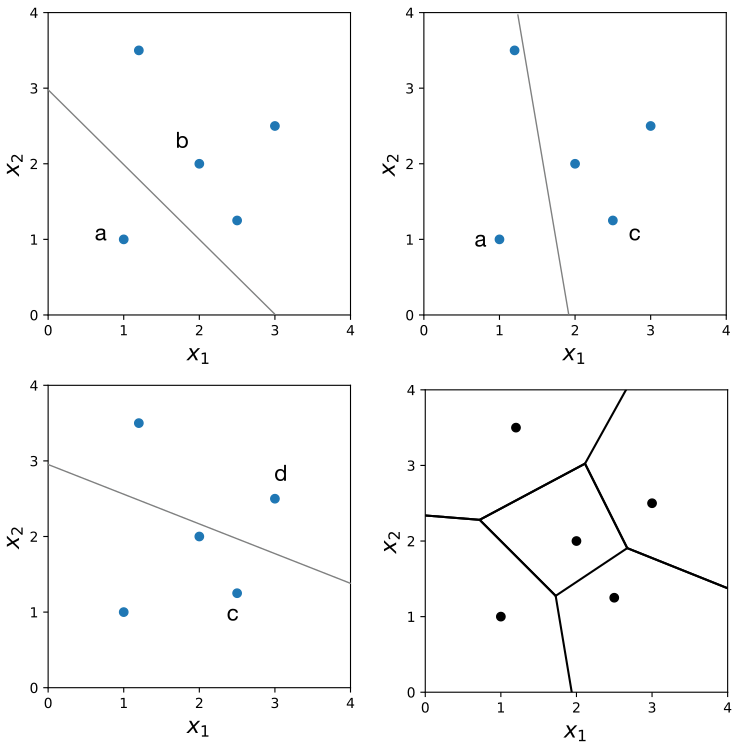]

.footnote[Автор: [Sebastian Raschka](https://sebastianraschka.com/)]

---

class: middle

.center.circle.width-60[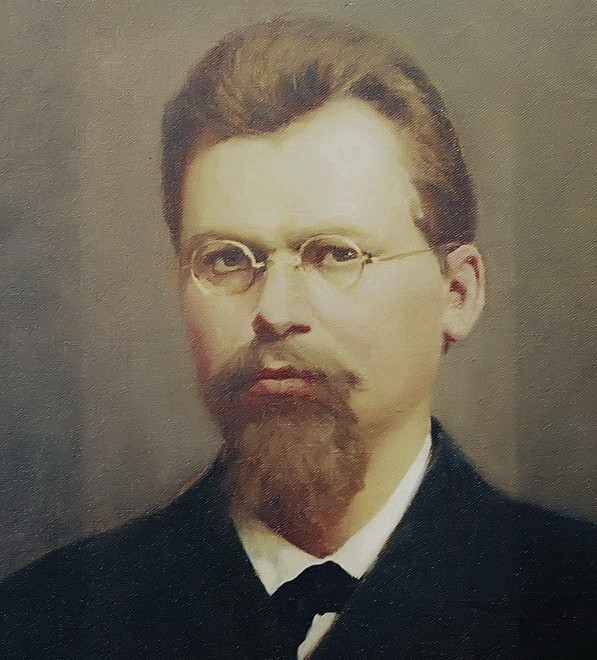]

.center.smaller-x[Георгій Феодосійович Вороний   (1868-1908)]

.footnote[Джерело: [Георгій Вороний. Алхімія у «діаграмі Вороного»](https://www.ukrinform.ua/rubric-culture/3226969-georgij-voronij-alhimia-u-diagrami-voronogo.html).]

???
Георгій Феодосійович Вороний - видатний український математик, народився 16 (28) квітня 1868 р. у селі Журавка Пирятинського повіту Полтавської губернії (нині – Варвинський район Чернігівської області). 

---

class: middle, black-slide, center

    <iframe src="https://demonstrations.wolfram.com/VoronoiDiagramsInTwoDimensionalRegions/" width="1000" height="900" style="position: absolute; top: -150px; left: -10px;" frameborder="0"></iframe>

Діаграми Вороного в двовимірних областях

---

class: middle

.center.width-70[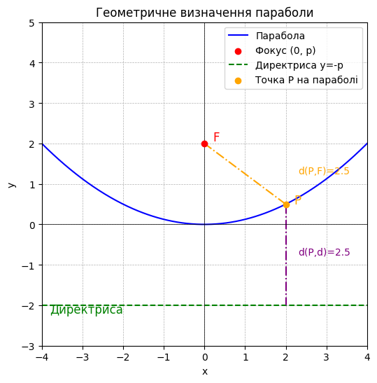]

$$y = \frac{x^2}{4p}$$

---

class: middle, black-slide, center

    <iframe src="https://demonstrations.wolfram.com/FortunesAlgorithmForVoronoiDiagrams/" width="1200" height="900" style="position: absolute; top: -120px; left: -80px;" frameborder="0"></iframe>

Алгоритм Форчуна для діаграм Вороного

---

class: middle

# Границя рішень для 1-NN

.center.width-100[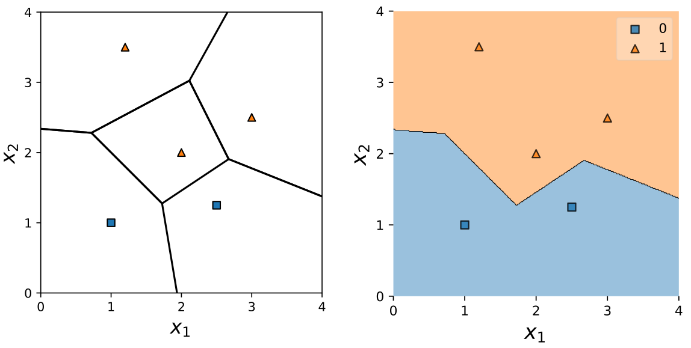]

.footnote[Автор: [Sebastian Raschka](https://sebastianraschka.com/)]

---

class: middle

# Який екземпляр найближчий?

.center.width-70[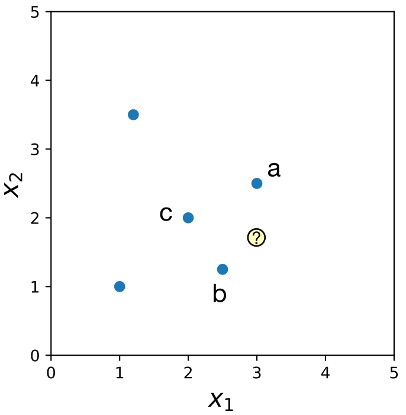]

.footnote[Автор: [Sebastian Raschka](https://sebastianraschka.com/)]

---

class: middle

# Залежить від міри відстані!

.center.width-100[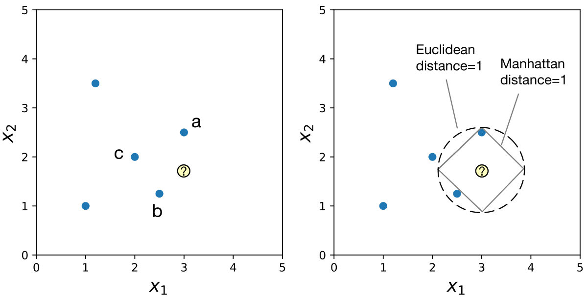]

.footnote[Автор: [Sebastian Raschka](https://sebastianraschka.com/)]

---

class: middle

# Неперервні міри відстані

.grid[
.kol-2-3[

Евклідова відстань: 

.larger-x[$\begin{aligned}d\big(\mathbf{X}^{(a)}, \mathbf{X}^{(b)}\big) = \sqrt{\sum\_{j=1}^m \left(\mathbf{X}_j^{(a)} - \mathbf{X}_j^{(b)}\right)^2} \end{aligned}$]

]

.kol-1-3[.center.width-70[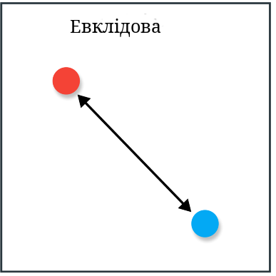]

  ]
]

---

class: middle

# Неперервні міри відстані

.grid[
.kol-2-3[

Мангеттенська відстань: 

.larger-x[$$\begin{aligned}d\big(\mathbf{X}^{(a)}, \mathbf{X}^{(b)}\big) =  \sum\_{j=1}^m |\mathbf{X}_j^{(a)} - \mathbf{X}_j^{(b)}| \end{aligned}$$]

]

.kol-1-3[
.center.width-70[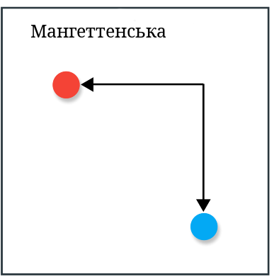]

  ]
]

---

class: middle

# Неперервні міри відстані

.grid[
.kol-2-3[

Чебишова відстань: 

.larger-x[$$\begin{aligned}d\big(\mathbf{X}^{(a)}, \mathbf{X}^{(b)}\big) =  \max\_{j=1}^m |\mathbf{X}_j^{(a)} - \mathbf{X}_j^{(b)}| \end{aligned}$$]

]

.kol-1-3[
.center.width-70[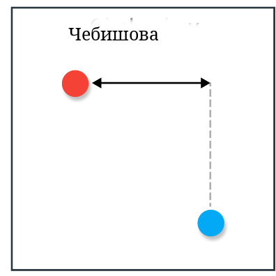]

  ]
]

---

class: middle

# Неперервні міри відстані

.grid[
.kol-2-3[

Мінковського відстань: 

$$\begin{aligned}d\big(\mathbf{X}^{(a)}, \mathbf{X}^{(b)}\big) =  \bigg[\sum\_{j=1}^m \big(|\mathbf{X}_j^{(a)} - \mathbf{X}_j^{(b)}|\big)^p \bigg]^{\frac{1}{p}} \end{aligned}$$

]

.kol-1-3[
.center.width-70[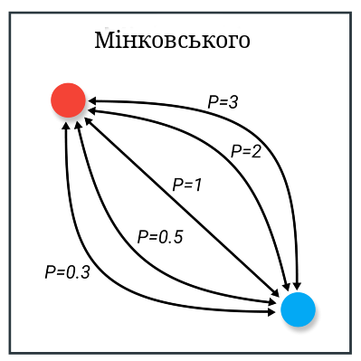]

  ]
]

---

class: middle

# Неперервні міри відстані

.grid[
.kol-2-3[

Гаверсинус кута $\theta$ визначається як:
$$  hav(\theta) = \sin^2 \bigg(\frac{\theta}{2}\bigg) $$

Відстань гаверсинуса: 

$$\begin{aligned}d =  2r \cdot arcsin \sqrt{hav(\phi_b - \phi_a) + \cos(\phi_a) \cos(\phi_b) hav(\lambda_b - \lambda_a)}\end{aligned},$$

де $r$ &mdash; радіус сфери, $\phi$ &mdash; широта, $\lambda$ &mdash; довгота.

]

.kol-1-3[
.center.width-70[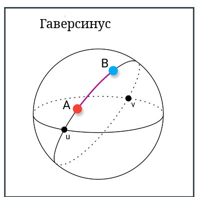]

  ]
]

???
Гаверсинус – це спеціальна тригонометрична функція, яка використовується у навігаційних розрахунках, зокрема для обчислення відстаней між двома точками на сфері (наприклад, між містами на Землі).

Гаверсинус допомагає уникнути проблем із малими кутами. При малих значеннях θθ, функція sin⁡(θ)sin(θ) змінюється повільно, що може призводити до похибок при обчисленнях. Функція гаверсинуса підвищує точність розрахунків, особливо при використанні оберненого синуса arcsin⁡arcsin.

---

class: middle

# Неперервні міри відстані

.grid[
.kol-2-3[

Відстань Махаланобіса: 

.larger-x[$\begin{aligned}d\big(\mathbf{X}^{(a)}, \mathbf{X}^{(b)}\big) = \sqrt{ \left(\mathbf{X}^{(a)} - \mathbf{X}^{(b)}\right)^T S^{-1} \left(\mathbf{X}^{(a)} - \mathbf{X}^{(b)}\right)} \end{aligned},$]

де $S^{-1}$ &mdash; коваріаційна матриця.

]

.kol-1-3[

  ]
]

???
Відстань Махаланобіса — це метрика, яка вимірює відстань між точкою та розподілом даних, враховуючи коваріацію між ознаками. Вона є узагальненою евклідовою відстанню, яка зважає на корельованість змінних.

Відстань Махаланобіса використовується в багатовимірному статистичному аналізі, зокрема при перевірці гіпотез, класифікації спостережень і в кластерному аналізі. У цих застосуваннях S є коваріаційною матрицею деякого багатовимірного розподілу, що дозволяє визначити відстань між випадковими векторами із цього розподілу із врахуваннями кореляцій між компонентами. У випадку коли S — одинична матриця, відстань Махаланобіса збігається з евклідовою відстанню. 

---

class: middle

# Дискретні міри відстані

.grid[
.kol-2-3[

Відстань Геммінга: 

$$\begin{aligned}d\big(\mathbf{X}^{(a)}, \mathbf{X}^{(b)}\big) =  \bigg[\sum\_{j=1}^m \big(|\mathbf{X}_j^{(a)} - \mathbf{X}_j^{(b)}|\big)^p \bigg]^{\frac{1}{p}} \end{aligned}$$

]

.kol-1-3[
.center.width-70[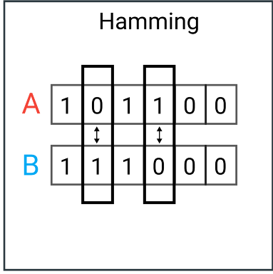]

  ]
]

---

class: end-slide, center
count: false

.larger-xx[Кінець]

